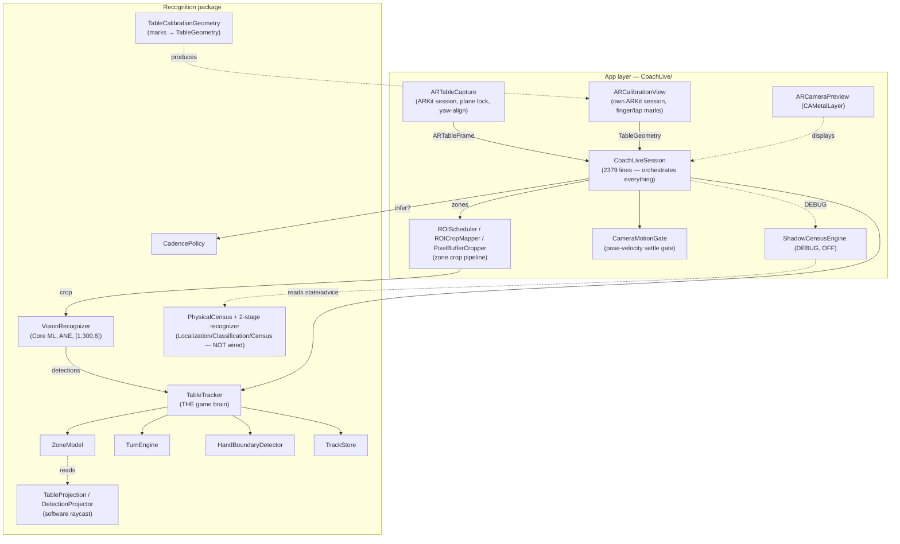
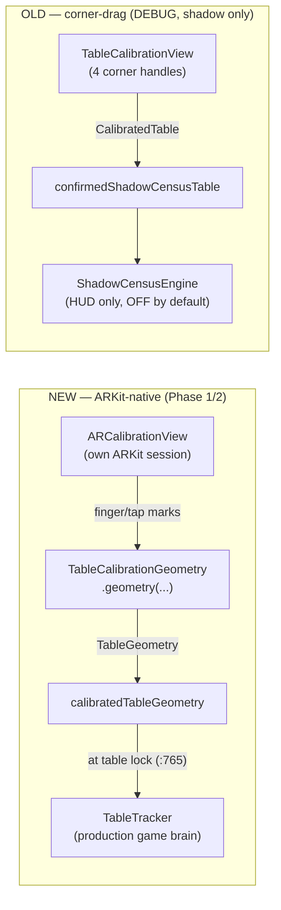

# Coach Live — AR Rework Handoff & Engineering Reference

**Status:** Phase 0 shipped & verified · Phases 1–2 code-complete (device-QA pending) · Phase 4 deferred
**Last updated:** 2026-07-19
**Audience:** whoever plans and implements the next round of Coach Live work
**Scope:** the "watch a live mahjong table through the phone and coach the player" feature — its product decisions, UX, the AR/capture pipeline, the recognition/game-brain stack, the model layer, and the open tech-debt.

> This document is a **snapshot of the code as it actually stands**, built from a full re-read of the pipeline (not from memory). Every claim is anchored to `file:line` so you can jump straight to it. Where something is aspirational, half-wired, or dead, it says so explicitly.

---

## Table of contents

1. [Executive summary](#1-executive-summary)
2. [Product vision & customer decisions](#2-product-vision--customer-decisions)
3. [Where we are right now](#3-where-we-are-right-now)
4. [UX / UI walkthrough](#4-ux--ui-walkthrough)
5. [System architecture](#5-system-architecture)
6. [The AR capture loop, tick by tick](#6-the-ar-capture-loop-tick-by-tick)
7. [Calibration: two disjoint paths](#7-calibration-two-disjoint-paths)
8. [The recognition & game brain](#8-the-recognition--game-brain)
9. [The model layer](#9-the-model-layer)
10. [Cadence, ROI cropping & the thermal model](#10-cadence-roi-cropping--the-thermal-model)
11. [File-by-file reference](#11-file-by-file-reference)
12. [Known gaps, risks & tech debt](#12-known-gaps-risks--tech-debt)
13. [Phase status & roadmap](#13-phase-status--roadmap)
14. [What "Phase 4 deferred" means, in detail](#14-what-phase-4-deferred-means-in-detail)
15. [Device-QA checklist](#15-device-qa-checklist)
16. [Open decisions for the next planning round](#16-open-decisions-for-the-next-planning-round)
17. [Glossary](#17-glossary)

---

## 1. Executive summary

**Coach Live** turns the phone into an over-the-table coach: point it at a live mahjong game and it tracks the state of play — your hand, the pond (discards), everyone's melds, whose turn it is, wind rotation — and offers advice. It uses **ARKit** to keep the table world-anchored so the phone can move, and a **two-stage tile detector** to read tiles, running detection *only when something changes* rather than every frame (for battery/heat).

The feature works today but had two chronic problems that triggered this rework:

- **It overheated in under a minute.** Root cause was *not* ARKit — it was the recognition workload (a debug "shadow census" firing ~45 Core ML inferences per settle-tick, plus a 53 MB detector as the default). **Fixed in Phase 0** (shipped, verified).
- **Calibration was fiddly and counting was unreliable.** The old flow made you drag four corners on a frozen frame. The rework replaces that with an **ARKit-native flow**: Apple's coaching overlay + grey plane grid, then you *point your finger or tap* to mark where your hand band and the pond are. Those marks become a compact table geometry that feeds the existing game brain. **Built and compiling (Phases 1–2), but never actually run** — ARKit doesn't execute in the Simulator, so it needs device QA before we trust it and before we delete the old path (Phase 4).

**The honest one-line status:** the thermal fix is real and in your hands now; the new calibration UX exists as code that builds on-device but has zero runtime miles on it.

---

## 2. Product vision & customer decisions

These are the decisions **you (the product owner) made** during the rework conversation. They are the guardrails for the next round — if any of these change, large parts of the design change with them.

### 2.1 The target experience

> Scan the plane → the user marks the table + zones (hand / pond / tiles) by pointing through the camera → ARKit keeps them world-anchored so the live feed is cropped per-zone for the detector → detection runs every few seconds, not every frame.

Inspiration was the ARKit "draw in the air with your finger" demos (ARPaint; the Toptal ARKit finger-drawing tutorial). **Important nuance you corrected me on:** those demos are *dated* (iOS 11 APIs — deprecated `hitTest` + a thumbnail tracked by `VNTrackObjectRequest`). The modern equivalents we actually use are `VNDetectHumanHandPoseRequest` for the fingertip and a **software raycast we already own** (`TableProjection.tablePoint`) for screen-point→plane. No ARKit raycast API is needed.

### 2.2 The four decisions (verbatim intent → what it means for design)

| # | Your decision | Design consequence |
|---|---|---|
| **D1** | **"We don't need precise location — ARKit is good enough. Just approximate: where tiles/hand are, and which is the pond."** | Zones are **coarse regions**, not pixel-perfect polygons. Hand-pose jitter is acceptable. The whole geometry is **3 scalars**, not a mesh. This is why the geometry model is so small (see §8.2). |
| **D2** | **"Use ARKit's default grey-scale table grid UI. If the table is too big, let the user adjust corners on screen."** | Calibration renders with `ARSCNView` + Apple's `ARCoachingOverlayView` + the default `ARPlaneAnchor` grey mesh — **not** a bespoke corner-handle UI. Corner-nudge is a *fallback* for big tables, not the primary interaction. |
| **D3** | **"Keep full game understanding."** — turns, discards, melds, wind rotation, advice. | `TableTracker` (the game brain) **stays untouched**. The rework only reshapes the layers *around* it (AR, capture, calibration, cadence). Calibration output feeds the brain by populating 3 scalars — a clean seam, no new tracker plumbing. |
| **D4** | **Fix all four pains:** calibration fiddly · counting unreliable · too complex to maintain · runs too often (heat). | Drives the whole phasing: Phase 0 = heat, Phase 1 = calibration UX, Phase 2 = counting (user-anchored zones cut mis-zoned tiles), Phase 4 = complexity (collapse the two "brains", delete dead calibration code). |

### 2.3 Model-strategy decision

> **"Remove the old model versions — we only need v3 models now. Default to the nano v3 model for everything."**

Done in Phase 0. Accepts the accuracy-for-thermal tradeoff (nano < large); heavier v3 models stay opt-in via the accuracy toggle / dev switcher. (See §9.)

### 2.4 Explicit non-goals / deferrals you accepted

- **Approximate zones are fine** (D1) — we are *not* chasing pixel-accurate table edges.
- **A naive fixed 3–20 s timer is a downgrade**, not the goal — the existing event-driven cadence (run on change / on settle / on staleness) is better and stays. The "every few seconds" intent is realized by *relaxing the idle interval*, not by replacing the trigger logic.
- **LiDAR** (Pro-device depth/occlusion) is a **Phase 5 follow-on**, deliberately off today.
- iPad/landscape is out of scope — the app is **iPhone-only, portrait-locked**, and Coach Live's AR geometry is hard-wired to portrait.

---

## 3. Where we are right now

### 3.1 Status board

| Phase | What | Status | Verified how |
|---|---|---|---|
| **0** | Thermal fix: shadow census OFF, v3-only / nano default, relaxed idle cadence | ✅ **Shipped** | Sim + device build green; 237 Recognition tests pass |
| **1** | ARKit-native calibration (ARSCNView + coaching overlay + finger/tap marks) | 🟡 **Code-complete, unrun** | Builds sim + device; pure math unit-tested. **AR runtime never executed** |
| **2** | Feed user-marked zones into the game brain (`TableGeometry` → tracker) | 🟡 **Code-complete, unrun** | Mapper unit-tested (5 tests). Consumed at tracker build; needs device |
| **3** | Relax cadence (folded into Phase 0) | ✅ **Shipped** | `idleInterval` 1.0→3.0 s; cadence test updated |
| **4** | Consolidation: retire shadow census + delete old calibration stack | ⏸️ **Deferred** | Gated on Phase 1–2 device QA — see §14 |
| **5** | LiDAR (Pro devices) for plane stability / occlusion | 💤 **Not started** | Optional follow-on |

### 3.2 What's safe vs. what's on approval

- **Safe / live now:** everything in Phase 0. Your phone should stay cool on the next build. Nano v3 is the universal default. Old v1/v2 models are gone from the app bundle (source `.pt` weights preserved in `Modeling/`).
- **Behind a DEBUG flag:** the new calibration is reachable only via triple-tap-the-LIVE-pill → **"Calibrate table (AR)"**. It does not run in the normal flow yet.
- **Untouched fallback:** the old corner-drag calibration and the shadow census still exist and still build. They are the safety net until the new path is proven.

---

## 4. UX / UI walkthrough

> **Screenshot note:** Coach Live's AR views (grey grid, finger-point marking, live overlay) are **device-only** — ARKit/`ARSCNView`/`VNDetectHumanHandPoseRequest` do not render in the iOS Simulator, so they cannot be captured headlessly from this environment. The wireframes below are faithful to the current view code; drop real device captures into the marked slots when you run it. The non-AR screens (Scan, results) *can* be captured from the Simulator on request.

### 4.1 Entering Coach Live

`ScanFlow.swift` → `ScanCoordinator.startCoachLive()` (`ScanFlow.swift:281`). On a real device it stops the plain camera (frees the capture device for ARKit), constructs `ARTableCapture`, starts it, builds `CoachLiveSession`, and warms the recognizer. On Simulator/DEBUG it falls back to a `MockCoachLive` — no ARKit, no real recognizer.

### 4.2 Startup → find-table → sweep → track (the normal play arc)

```
┌─────────────────────────────────────────────────────────┐
│  ●  LIVE            Coach Live               [ Rescan ]   │   ← LIVE pill (triple-tap = debug HUD)
│                                                          │
│                                                          │
│            ╱▒▒▒▒▒▒▒▒▒▒▒▒▒▒▒▒▒▒▒▒▒▒╲                       │
│          ╱▒▒▒  "Move your phone    ▒▒╲                    │   ← ARCoachingOverlayView (Apple's
│        ╱▒▒▒▒   to find the table"   ▒▒▒╲                  │      onboarding) during .findingTable
│       ▒▒▒▒▒▒▒▒▒▒▒▒▒▒▒▒▒▒▒▒▒▒▒▒▒▒▒▒▒▒▒▒▒                   │
│                                                          │
│   ┌────────────────────────────────────────────────┐    │
│   │  Hold steady…   /   Reading table…   /  advice   │    │   ← status chip (cameraMoving / phase)
│   └────────────────────────────────────────────────┘    │
└─────────────────────────────────────────────────────────┘
```

Stages (`CaptureStage` + `startupStage`): `.startingCamera` → `.findingTable` → **table locks** → `.loadingDetector` → a **sweeping** pass (move the phone around the table so every zone is seen once) → **tracking** (steady state). If the plane never locks within **25 s** (`arLockDeadline`, `CoachLiveSession.swift:673`) or ARKit is unavailable, it degrades gracefully to a **2D full-frame loop** (`usingFallbackCapture = true`).

Once tracking, the live overlay shows the tracked state — your hand, pond, melds, turn, advice — published from `TableTracker.state` (see §8.1). The feed itself renders through the lightweight `ARCameraPreview` (a `CAMetalLayer`, throttled to 15–30 fps), **not** SceneKit, deliberately, for thermal reasons.

### 4.3 The NEW calibration flow (Phase 1) — device-only

Reachable today via **triple-tap the LIVE pill → debug HUD → "Calibrate table (AR)"** (`LiveFeedPane.swift:321` → `session.beginARCalibration()`). It presents `ARCalibrationView` full-screen, which runs its **own** ARKit session (so it pauses the main `arCapture`).

```
   STEP 1 — coaching                STEP 2 — mark hand band          STEP 3 — mark pond
┌───────────────────────────┐  ┌───────────────────────────┐  ┌───────────────────────────┐
│  (Apple coaching overlay: │  │  "Point at the near edge   │  │  "Point at the edge of the │
│   move phone to find a     │  │   of YOUR tiles, or tap"   │  │   central pond, or tap"    │
│   horizontal plane)        │  │                            │  │                            │
│                            │  │      ╱▦▦▦▦▦▦▦▦▦▦▦╲          │  │      ╱▦▦▦▦▦▦▦▦▦▦▦╲          │
│    ▦▦▦ grey plane grid ▦▦▦ │  │    ╱▦▦▦▦▦▦▦▦▦▦▦▦▦╲         │  │    ╱▦▦▦▦●(pond)▦▦▦╲        │
│    ▦▦▦▦▦▦▦▦▦▦▦▦▦▦▦▦▦▦▦▦▦▦▦ │  │   ▦▦▦▦▦▦▦▦▦▦▦▦▦▦▦▦▦        │  │   ▦▦▦▦▦▦▦▦▦▦▦▦▦▦▦▦▦        │
│                            │  │   ●———— dot lands here     │  │                            │
│                            │  │        (hand edge)         │  │                            │
│  [ Use finger ]  [ Tap ]   │  │  [ Use finger ]  [ Next ]  │  │  [ Use finger ] [ Confirm ]│
└───────────────────────────┘  └───────────────────────────┘  └───────────────────────────┘
        ARCoachingOverlayView         MarkStage.handBandEdge          MarkStage.pondEdge → .done
        goal .horizontalPlane
```

- **Interaction (`MarkStage`):** `.handBandEdge` → `.pondEdge` → `.done` (`ARCalibrationView.swift:60`). Each mark is placed either by **tapping the grey grid** (`handleTap`, `:294`) or by **pointing** — `HandPoseFingertip.indexFingertipOrientedPoint` finds your index fingertip, which is raycast onto the plane (`useFingerTapped`, `:315`).
- **On Confirm** (`:401`): reads the plane extent, calls `TableCalibrationGeometry.geometry(extentMetres:handBandInnerEdge:pondEdge:)`, and returns a `TrackerConfig.TableGeometry` via `onComplete`. The session stores it in `calibratedTableGeometry` and resumes the main capture (`finishARCalibration`, `CoachLiveSession.swift:297`).

**[DEVICE SCREENSHOT SLOT: capture the three steps above on a real iPhone.]**

### 4.4 The debug HUD (developer surface)

Triple-tap the LIVE pill (`LiveFeedPane.swift:297`) opens the HUD. It shows:
- **ROI plan** line (`diagnostics.roiPlan` — `.fullFrame` / `.crops` / `.none`) — `LiveFeedPane.swift:315`
- **Census summary** line (only meaningful if shadow census is on) — `:318`
- **`cal:` geometry** line (the active `TableGeometry` scalars) — `:319`
- **"Calibrate table (AR)"** button — `:321`

### 4.5 The OLD calibration (corner-drag) — still present, DEBUG-only, shadow-census-only

`TableCalibrationView` (`TableCalibrationView.swift:26`): four draggable corner handles over the camera preview, a "Hand boundary" slider, a mandatory "Confirm table" button, and a "Rescan" link. **This drives only the shadow census, not the production tracker**, and only appears when `runShadowCensus` is on (off by default). It's the code Phase 4 will delete once the new path is proven.

---

## 5. System architecture

### 5.1 The big picture



### 5.2 The load-bearing idea: one game brain, reshaped surroundings

`TableTracker` is the **single owner of game state**. Everything else is plumbing that (a) gets pixels to the detector efficiently, (b) keeps the table world-anchored, and (c) tells the brain *where* the zones are. The rework's whole philosophy (per decision **D3**) is: **don't touch the brain; simplify and improve the plumbing.** Calibration feeds the brain through one tiny value type — `TableGeometry` (3 scalars) — which is the clean seam that makes user-marked zones "just work" without new tracker code.

---

## 6. The AR capture loop, tick by tick

`CoachLiveSession.startARLoop(...)` (`CoachLiveSession.swift:670`) is a single `Task { @MainActor }` polling at ~120 ms. Per tick:

1. **Read `arCapture` fresh** (`:703`) and update the startup overlay stage.
2. **Never-locks fallback** (`:719`): if no tracker yet and (ARKit unavailable OR past the 25 s `arLockDeadline`) → pause AR, restart the plain camera, switch to the 2D `startLoop`, and break.
3. **Grab the latest frame** (`:740`); record oriented image size once.
4. **Table lock → build the tracker** (`:753`): once `arCapture.lockedPlaneTransform != nil`, build `TrackerConfig` with `coordinateSpace = .tableSpace` and
   `config.tableGeometry = self.calibratedTableGeometry ?? TrackerConfig.TableGeometry()` (`:765`) —
   **this is the one and only place calibration enters the brain.** Then `beginSession`/`restore` and enter the sweeping stage.
5. **Relocalizing freeze** (`:825`): if ARKit is relocalizing, hold.
6. **Sweeping recipe** (`:842`): relaxed motion tolerance, always full-frame, bypass the ROI scheduler; exit when the user taps done *or* (≥12 s elapsed AND coverage complete) → enter tracking, force one inference.
7. **Steady-state tracking** (`:956`): `CameraMotionGate.update` → `moving`. If moving, publish "Hold steady…" and skip. On the moving→still edge (`justSettled`), force an inference. Otherwise sample motion, detect darkness, read thermal state, and ask `CadencePolicy.decide(...)`. On `.infer`, build a `TableProjection`, compute zone rects, and run the ROI switch (§10).

### 6.1 Plane lock & the yaw contract

`ARTableCapture.processFrame` (`ARTableCapture.swift:193`) drives `PlaneLockPolicy`. Promotion requires the same plane candidate winning for **2.0 s** with center drift < **0.02 m**, within **1.5 m** of the camera. On lock it **turns plane detection off** (re-runs the config with `planeDetection: false`) to save power, and **yaw-aligns** the anchor basis so **local +Z points toward the user** (`PlaneLockPolicy.yawAligned`, `:192`). That "+Z toward me" is a **locked contract** the whole geometry stack depends on — the calibration math, `TableProjection`, and `ZoneModel`'s table-space edges all assume it.

---

## 7. Calibration: two disjoint paths

This is the single most important thing to understand before touching calibration: **there are two separate calibration outputs that flow to two different consumers.** They do not share code or state.



| | **New (ARKit-native)** | **Old (corner-drag)** |
|---|---|---|
| UI | `ARCalibrationView` — grey grid + coaching overlay + finger/tap | `TableCalibrationView` — 4 draggable corners + slider |
| Output type | `TrackerConfig.TableGeometry` (3 scalars) | `CalibratedTable` (4 corners + zones) |
| Stored in | `calibratedTableGeometry` (`CoachLiveSession.swift:311`) | `confirmedShadowCensusTable` |
| Consumed by | **`TableTracker`** — the real game brain (`:765`) | **`ShadowCensusEngine`** — DEBUG HUD only |
| Runs when | triple-tap → "Calibrate table (AR)" | only if `runShadowCensus == true` (off) |
| Fate | the future | deleted in Phase 4 |

### 7.1 One critical timing constraint

`calibratedTableGeometry` is read **exactly once**, at table lock (`CoachLiveSession.swift:765`). After that the loop reads geometry from the built `TrackerConfig`. **Therefore calibration must happen *before* the plane locks, or after a rescan re-lock.** Today the DEBUG button is manual, so the current entry-flow sequencing (calibrate → then let it lock) is one of the things device QA must validate — and is a strong argument for wiring calibration *automatically before* the play loop (an open decision, §16).

### 7.2 A dead third stack (don't be fooled by it)

`TableCalibrationController` (`:335 lines`) and `TableQuadProposal` (`:268`) are complete implementations of a v2.5 "scored plane selection + quad fitting" design — **but nothing in the live loop constructs or calls them.** `ARTableCapture` still uses `PlaneLockPolicy`. Treat these two files as **not wired in**; they are candidates for deletion or future adoption, but they are not on any active path today.

---

## 8. The recognition & game brain

### 8.1 `TableTracker` — the single game brain

`TableTracker` (`Tracking/TableTracker.swift:50`) composes four pieces behind one `ingest` call and publishes snapshots:

- `TrackStore` — identity/association (ByteTrack-adapted; stable tracks from raw detections)
- `ZoneModel` — assigns each track a zone (my hand / my melds / pond / opponent melds / unresolved)
- `TurnEngine` — settle-diff events (discard/meld/draw), turn attribution, wind-complete
- `HandBoundaryDetector` — mass-disappearance → non-destructive "hand ended?" proposal

**Public surface you care about:** `beginSession(mySeatWind:roundWind:at:)`, `ingest(detections:at:motion:visibleRegion:)`, `snapshot(at:)`/`restore(...)` (persistence — confirmed state only), correction APIs (`pin`, `overrideZone`, `insertMissedTile`, `removeTrack`, `amendEvent`, `deleteEvent`), and `confirmHandEnd`/`dismissHandEnd`. It publishes `state: TrackedTableState`, `events: [GameEvent]`, `pendingHandEnd`, and `diagnostics`.

**Ingest order (every settled frame):** `store.associate` → settle gate → `zoneModel.ingestSettled` → `turnEngine.commitSettled` → `boundaryDetector.evaluateSettled` → rebuild `state`. The settle gate is the throttle: non-settled motion returns without committing.

**The advice seam:** `waitImpactAnnotator` (`:73`) is an injected closure the EfficiencyEngine fills in — Recognition never imports the coaching layer. This keeps the game brain platform-pure and testable.

### 8.2 `TableGeometry` — the 3-scalar seam (this is the whole calibration payload)

`TrackerConfig.TableGeometry` (`Tracking/TrackerConfig.swift:232`):

| Field | Default | Unit | Meaning |
|---|---|---|---|
| `extent` | `0.9` | **metres** | Physical metres spanned by table-space [0,1]. Carried for the app's projector; **not read by ZoneModel**. |
| `handBandDepth` | `0.18` | **fraction of extent** | Depth of the hand-rank band inward from an edge (≈15 cm on a 0.9 m table). Also how far an opponent meld must hug its edge. |
| `pondRadius` | `0.30` | **fraction of extent** | Radius of the central pond disk around (0.5, 0.5) (≈central 50 cm). |

That's it. Coarse-by-design (decision **D1**). In `.tableSpace` mode, `ZoneModel.isBandCalibrated` is simply `tableGeometry != nil` — the image-space auto-calibration heuristics are bypassed entirely. This is *why* user-marked zones improve counting: they replace fragile learned zones with a geometry the user physically pointed at.

### 8.3 `TableCalibrationGeometry` — marks → geometry (pure, unit-tested)

`Tracking/TableCalibrationGeometry.swift:17`. Inputs are points in anchor-local plane **metres** (the space `TableProjection.tablePoint` returns; +z toward the user, user edge at `z = +extent/2`):

- `extent = extentMetres.clamped(0.40...1.60)` (else default 0.9)
- `handBandDepth`: `depthMetres = extent/2 − edge.y`, then `(depthMetres / extent).clamped(0.06...0.45)`
- `pondRadius`: `radiusMetres = hypot(pond.x, pond.y)`, then `(radiusMetres / extent).clamped(0.10...0.45)`

Five unit tests cover it (all passing). This is the platform-neutral heart of Phase 1 that *can* be verified without a device — and is.

### 8.4 `TableProjection` — the software raycast (no ARKit raycast API needed)

`Tracking/TableProjection.swift:94`. Pure simd; all matrices injected. Two directions:

- `tablePoint(ofNormalizedOrientedPoint:orientedImageSize:)` — screen point → plane point (used for finger/tap marks and zone projection)
- `normalizedOrientedPoint(ofTablePoint:...)` — the inverse (project a zone back onto the image to crop it)

This is the piece that lets us do finger-pointing *without* the deprecated ARKit `hitTest` from the old demos.

### 8.5 A second, not-yet-wired recognizer pipeline

Under `Recognition/{Observation,Localization,Classification,Coverage,Census}/` there is a newer, §-numbered **two-stage recognizer + physical census** (locator → classifier → `PhysicalCensus` with conservation/coverage diagnostics). **It does not feed `TableTracker` yet.** Today it runs *only* through the DEBUG `ShadowCensusEngine` (HUD display, off by default). Phase 4's open question is whether to retire it or fold its sanity checks (≤4 per suit, coverage-aware "unknown") into `TableTracker`.

---

## 9. The model layer

### 9.1 Detector models (post-v3 consolidation)

`DetectorModel` enum (`ScanFlow.swift:20`) — **note rawValues don't match case names 1:1**:

| Case | Bundle resource | Modeling source | weight.bin | Role |
|---|---|---|---|---|
| `.nanoV3` | `MahjongTileDetectorNanoV3` | `mjss-n-v3.pt` | ~4.6 MB | **default everywhere** |
| `.smallV3` | `MahjongTileDetectorSmallV3` | `mjss-s-v3.pt` | ~18 MB | balanced (opt-in) |
| `.mediumV3` | `MahjongTileDetectorMediumV3` | `mjss-m-v3.pt` | ~39 MB | more accurate (opt-in) |
| `.largeV3` | **`MahjongTileDetectorProV3`** | `mjss-l-v3.pt` | ~47 MB | most accurate (opt-in) |

Nano v3 is the release default (`prefersHighAccuracy` unset → `false`), the dev-switcher fallback, the `VisionRecognizer` init default, and the `detect-dump`/`video-dump` default. The 43-class label contract is `HKDetectorLabels.ordered` (1m–9m, 1p–9p, 1s–9s, winds, dragons, flowers, seasons, `back` = 42).

**Bundled on disk** (`App/Sources/Resources/Models/`): the four detectors above **plus** `MahjongTileLocatorV3.mlpackage` (~4.6 MB, single-class `{0:'tile'}` — the Stage-1 locator). The old v1 `MahjongTileDetector` and v2 `MahjongTileDetectorPro` are **removed** from the app (source `.pt` weights kept in `Modeling/`).

### 9.2 `VisionRecognizer`

`VisionRecognizer.swift:32`. Loads `<name>.mlmodelc`; compute units are **`.cpuAndNeuralEngine`** deliberately (the GPU MPSGraph compiler crashes on these YOLO26 graphs). Confidence threshold 0.30. Expects the NMS-free YOLO26 output `[1, 300, 6]` (rows `[x1,y1,x2,y2,conf,classIdx]` in 640-px letterboxed space), decodes with class-agnostic greedy NMS at IoU 0.55, `.scaleFit` letterbox (matches training).

### 9.3 The two-stage census (locator → classifier → PhysicalCensus)

- **Stage 1 — locator** (`PrototypeLocator`): wraps a `Recognizer`, keeps **box + confidence only** (discards the face), so the single-class `MahjongTileLocatorV3` works unchanged. Sees face-down tiles (`back`).
- **Stage 2 — classifier** (`PrototypeClassifier`): the 43-class detector as a **placeholder** — the dedicated face classifier isn't trained yet. Runs on each per-tile crop.
- **Stage 3 — `PhysicalCensus`**: association → lifecycle → face fusion → ownership → conservation → snapshot. Platform-pure.

**Inference cost when enabled** (`ShadowCensusEngine`, `maxTilesPerFrame = 40`): per settle tick, one locator call per qualified zone (≤5) **plus one classifier call per located tile** (≤40) — the "~45×" multiplier that was cooking the phone. **This is why it defaults OFF.**

---

## 10. Cadence, ROI cropping & the thermal model

### 10.1 Why it overheated (the diagnosis)

ARKit world-tracking is cheap (runs for hours in Apple's own apps). The heat was **the recognition workload**, two multipliers, both live in the DEBUG builds we test on:

1. The DEBUG **shadow census** firing ~45 Core ML inferences per settle tick (§9.3), *on top of* the production tracker's own inference.
2. Coach Live defaulting to the **53 MB large** detector.

`MotionDetector` (a 32×18 luma grid, ~0.3 ms) was investigated and cleared — not a suspect.

### 10.2 The fix (Phase 0)

- `runShadowCensus = false` by default (`CoachLiveSession.swift:253`) — kills the 45× multiplier unless a dev explicitly turns it on.
- Nano v3 everywhere (~4.6 MB vs 53 MB).
- `CadencePolicy.idleInterval` 1.0 → **3.0 s** and `seriousIdleInterval` 2.0 → **5.0 s** — a settled table now polls the detector ~0.33 Hz instead of ~1 Hz, still with fast settle/motion triggers.

### 10.3 How cadence & cropping actually decide to run the detector

Steady-state, per still tick:

1. **`CameraMotionGate`** (pose-velocity; thresholds 0.12 m/s, 25°/s). Moving → skip entirely. Moving→still edge → force one inference.
2. **`CadencePolicy.decide`** → `.suspend` (thermal critical) / `.skip` (too soon) / `.infer`. Intervals scale with `ProcessInfo.thermalState` (nominal → ×1, fair → ×1.5, serious/critical → the "serious" values).
3. On `.infer`, **`ROIScheduler.decide`** returns:
   - `.fullFrame` — on `justSettled` or every **20 s** safety net
   - `.crops([rect])` — zones whose motion cells changed (hand first if it's your turn), **capped at 2 crops**
   - `.none` — nothing dirty
4. **`ROICropMapper`** (pure math) turns oriented zone rects into native even-snapped pixel rects and inverts detection boxes back; **`PixelBufferCropper`** slices the native buffer into a pooled buffer.

> **Naming caution:** `ROIScheduler` is a real **283-line file in the app** (`App/.../Capture/ROIScheduler.swift`). The Recognition package's `CadencePolicy` only *mentions* a "20 s full-frame safety net" in prose — there is no `ROIScheduler` type inside the Recognition package. Don't go looking for it there.

---

## 11. File-by-file reference

### App — `App/Sources/Features/CoachLive/`
| File | Lines | Role |
|---|---|---|
| `CoachLiveSession.swift` | 2379 | Orchestrator. `startARLoop` (AR), `startLoop` (2D fallback), calibration intents, shadow-census wiring, persistence |
| `CoachLiveView.swift` | — | SwiftUI host; both calibration `.fullScreenCover`s (DEBUG) |
| `LiveFeedPane.swift` | — | Live feed + status chips + debug HUD (triple-tap) |
| `Capture/ARTableCapture.swift` | 311 | ARKit session owner; plane lock, yaw-align, frame extraction |
| `Capture/ARTableFrame.swift` | 68 | Per-frame value snapshot |
| `Capture/ARCameraPreview.swift` | 94 | `CAMetalLayer` preview (15–30 fps); used by live feed **and** old calibration |
| `Capture/CaptureStage.swift` | 55 | Lifecycle enum |
| `Capture/PlaneLockPolicy.swift` | 222 | Plane promotion + the +Z-toward-user yaw contract (live) |
| `Capture/CameraMotionGate.swift` | 72 | Pose-velocity settle gate |
| `Capture/ROIScheduler.swift` | 283 | Per-tick inference planner + `TableZoneID` (5 zones) |
| `Capture/ROICropMapper.swift` | 170 | Pure coordinate math (zone rect ↔ crop ↔ full image) |
| `Capture/PixelBufferCropper.swift` | 85 | Native buffer crop into a pooled buffer |
| `Capture/HandPoseFingertip.swift` | 87 | `VNDetectHumanHandPoseRequest` fingertip (calibration-only) |
| `Capture/ARCalibrationView.swift` | 413 | **NEW** ARKit-native calibration (own session, finger/tap) |
| `Capture/ShadowCensusEngine.swift` | 368 | **DEBUG** shadow census (OFF); the 2-stage census wiring |
| `Capture/TableCalibrationView.swift` | 189 | **OLD** corner-drag calibration (DEBUG, shadow only) |
| `Capture/CalibratedTable.swift` | 160 | Corner-drag output: quad + derived zones |
| `Capture/TableCalibrationController.swift` | 335 | v2.5 scored plane selection — **NOT wired in** |
| `Capture/TableQuadProposal.swift` | 268 | v2.5 quad fitting — **NOT wired in** |

### Recognition — `Packages/Recognition/Sources/Recognition/`
| File | Role |
|---|---|
| `VisionRecognizer.swift` | Core ML inference (ANE, `[1,300,6]`, 43-class + raw-box paths) |
| `Tracking/TableTracker.swift` | **The game brain** (facade over the four pieces) |
| `Tracking/TrackerConfig.swift` | All tunables + `TableGeometry` + `CoordinateSpace` |
| `Tracking/ZoneModel.swift` | Zone assignment (image-space voting **and** table-space fixed geometry) |
| `Tracking/TurnEngine.swift` | Events, turns, seat attribution |
| `Tracking/HandBoundaryDetector.swift` | Non-destructive hand-end proposal |
| `Tracking/TrackStore.swift` | Identity/association core |
| `Tracking/TableProjection.swift` | Software raycast (screen ↔ plane) |
| `Tracking/DetectionProjector.swift` | Oriented-image detections → table space |
| `Tracking/CadencePolicy.swift` | `.infer/.skip/.suspend` decision + thermal scaling |
| `Tracking/TableCalibrationGeometry.swift` | **Marks → `TableGeometry`** (pure, unit-tested) |
| `Tracking/MeldClassifier.swift`, `WindRotation.swift`, `MotionDetector.swift`, `TrackingModels.swift` | Supporting game logic + data contracts |
| `Observation/ Localization/ Classification/ Coverage/ Census/` | The newer 2-stage recognizer + `PhysicalCensus` — **not wired to `TableTracker`** |

### Models
- Bundled: `App/Sources/Resources/Models/` — 4 detectors + `MahjongTileLocatorV3`.
- Source: `Modeling/` — `mjss-{n,s,m,l}-v3.pt/.mlpackage`, `v3-single-class.pt/.mlpackage`, older `mjss-yolo26{n,l}` checkpoints, training project `Modeling/mjss/`.

---

## 12. Known gaps, risks & tech debt

1. **The new calibration has zero runtime miles.** It builds on device but ARKit/`ARSCNView`/hand-pose don't run in the Simulator. Everything in §4.3 is *unverified behavior*.
2. **Two parallel recognizer stacks.** The live `ZoneModel`/`TableTracker` path and the not-wired `Census/…` two-stage pipeline coexist. This is confusing and is exactly what Phase 4 is meant to resolve (retire or fold in).
3. **Three calibration stacks in the tree**, only one of which feeds the brain (§7). The corner-drag (`TableCalibrationView`/`CalibratedTable`) and the dead v2.5 (`TableCalibrationController`/`TableQuadProposal`) are both deletion candidates.
4. **`calibratedTableGeometry` is read once at lock (§7.1).** The manual DEBUG entry makes the calibrate-before-lock ordering easy to get wrong. Auto-wiring calibration before the play loop would remove the footgun.
5. **The Stage-2 classifier is a placeholder** — the 43-class detector stands in for a dedicated, untrained face classifier. Counting quality via the census path is therefore capped until that model exists.
6. **`ARCameraPreview` coupling:** it's used by both the live feed and the old calibration view, and it polls `arCapture.latestFrame` — during ARKit-native calibration (which pauses `arCapture`) the old view would freeze. Harmless today (the two covers are mutually exclusive), but a trap if someone re-enables the shadow path.
7. **`CoachLiveSession` is 2,379 lines** and not `@MainActor`, so it threads `MainActor.assumeIsolated` through many methods. It's the natural candidate for a decomposition once the AR path settles.

---

## 13. Phase status & roadmap

- **Phase 0 — Thermal + model consolidation.** ✅ Shipped, verified. (§10.2)
- **Phase 1 — ARKit-native calibration.** 🟡 Code-complete, device-QA pending. New files: `ARCalibrationView`, `HandPoseFingertip`, `TableCalibrationGeometry`. Wired behind the DEBUG button.
- **Phase 2 — User-marked zones → game brain.** 🟡 Code-complete. `calibratedTableGeometry` consumed at tracker build. Unit-tested mapper; runtime needs device.
- **Phase 3 — Relax cadence.** ✅ Folded into Phase 0.
- **Phase 4 — Consolidation (deletions).** ⏸️ Deferred — see §14.
- **Phase 5 — LiDAR (Pro devices).** 💤 Optional follow-on: `sceneDepth`/`sceneReconstruction` for stabler planes + real occlusion, gated on device + thermal budget.

---

## 14. What "Phase 4 deferred" means, in detail

Phase 4 is the **cleanup/consolidation** phase — the *destructive* changes held back until the new calibration is proven on-device. Nothing in it adds capability; it all **removes working code** in favor of code that currently only *compiles*. That's why it's gated.

### 14.1 Retire the DEBUG shadow "second brain"
- **Files:** `Capture/ShadowCensusEngine.swift` + the `Recognition/Census/…` shadow wiring.
- Phase 0 already turned it **off** (`runShadowCensus = false`) — that's what killed the heat. Phase 4 is **deleting it** entirely, *or* salvaging just its conservation/coverage sanity checks (≤4 per suit, coverage-aware "unknown") into `TableTracker` as a lightweight validity layer.
- **Why deferred:** it's still runnable behind the flag and is the diagnostic I'd compare against if the new path counts worse. Delete only once the new path is trusted.

### 14.2 Delete the old corner-drag calibration stack
- **Files:** `Capture/TableCalibrationView.swift` (corner handles), `Capture/CalibratedTable.swift`, and the dead v2.5 pair `TableCalibrationController.swift` + `TableQuadProposal.swift`.
- These implement the *old* "drag four corners on a frozen frame" UX that `ARCalibrationView` replaces.
- **Why deferred:** the new AR calibration has never run (§12.1). Until you confirm on-device that finger/tap → a sane `TableGeometry` → correct zones, the corner-drag path is the working fallback. Deleting it blind could leave you with **no usable calibration** if the new one misbehaves.

### 14.3 The line I drew
Phase 0 was safe to ship because it only changed *defaults* and removed unused *models* — never the calibration logic. Phase 4 removes logic. Rule: **keep both paths runnable until the new one proves out on hardware, then delete in one clean pass.**

### 14.4 What unblocks Phase 4
A single on-device session confirming the §15 checklist. Once you've seen the new calibration produce correct zones and full game understanding still fire, I'll: delete the four files in §14.2, decide the census's fate (§14.1), and remove the now-dead DEBUG wiring — verified with a green build + the test suite.

---

## 15. Device-QA checklist

Run on a real iPhone (ARKit required). Ordered roughly by the play arc:

- [ ] **Coaching overlay** appears and the **grey plane grid** renders on the table.
- [ ] **Plane locks** within a few seconds; the "+Z toward me" yaw alignment looks right (hand band is on *your* side).
- [ ] **Finger-point marking:** the landing dot tracks your fingertip plausibly; dwell-to-place feels usable.
- [ ] **Tap-to-mark** on the grid works as the fallback.
- [ ] **Large-table** corner nudge works (decision D2 fallback).
- [ ] **Calibrate-before-lock sequencing:** confirm the geometry actually reaches the tracker (watch the HUD `cal:` line and zone behavior). Test the rescan → re-lock path too.
- [ ] **Dual-session pause/resume:** entering AR calibration pauses `arCapture`; exiting resumes cleanly with no camera-device contention.
- [ ] **Zones crop correctly:** hand/pond/meld crops land on the right physical regions; tile counts populate per zone.
- [ ] **Full game understanding still fires:** turn, discard, meld, wind rotation, advice.
- [ ] **Cadence:** detector call-rate drops when the table is still (log the ROI plan); `ProcessInfo.thermalState` stays reasonable over ~20 min.
- [ ] **Fallback:** cover the plane / deny ARKit → the 25 s `arLockDeadline` degrades to the 2D loop without crashing.

---

## 16. Open decisions for the next planning round

You said there's "a lot of room for improvement" — agreed. Here are the decisions worth making *before* the next implementation sprint, with my recommendation on each:

1. **Auto-wire calibration before the play loop?** Today it's a manual DEBUG button, and the read-once-at-lock timing (§7.1) is a footgun. **Recommend:** yes — present `ARCalibrationView` automatically after plane-find and before `beginSession`, removing the ordering hazard. (This was your original intent: "scan the plane → user marks zones → track.")
2. **Census fate (Phase 4.1).** **Recommend:** retire the shadow pass; optionally fold conservation/coverage as a sanity layer into `TableTracker` later. One brain is the goal (D4: less complexity).
3. **Train the dedicated Stage-2 face classifier?** The placeholder caps census-path accuracy (§12.5). Decide whether the two-stage census is even on the roadmap, or whether the single-model `TableTracker` path is sufficient — this determines whether the `Census/…` folders live or die.
4. **Decompose `CoachLiveSession` (2,379 lines).** **Recommend:** after the AR path settles, split the AR loop, the 2D loop, persistence, and calibration into separate types. Not urgent, but it's the biggest maintainability lever.
5. **LiDAR (Phase 5).** Decide if plane instability/occlusion is a real counting problem on your devices before investing.
6. **Corner-nudge scope (D2).** Confirm whether big-table corner adjustment needs to survive into the new flow, or whether coarse marks + extent are enough — this decides how much of the old corner-drag math to port vs. delete.

---

## 17. Glossary

- **Zone** — a coarse table region: my hand, my melds, pond (discards), an opponent's melds, unresolved.
- **Table space** — normalized [0,1]² plane coordinates, anchor at (0.5, 0.5), +y toward the user; [0,1] spans `extent` metres.
- **Oriented image space** — the captured buffer rotated `.right` to portrait, normalized; the space `DetectedTile.box` lives in.
- **Settle / settled** — the phone is (nearly) still and the scene stopped changing; the only time state is committed.
- **Sweep** — the one-time "move the phone around so every zone is seen" pass after lock.
- **Shadow census** — a DEBUG parallel tile-counting pass (2-stage recognizer + `PhysicalCensus`); HUD-only, OFF by default; the old thermal culprit.
- **ROI plan** — per-tick decision to run the detector on the full frame, on specific crops, or not at all.
- **Cadence** — the policy deciding *when* to run the detector (settle edge, motion, staleness, thermal).

---

*Generated from a full re-read of the pipeline on 2026-07-19. Every `file:line` reference reflects the tree at that time; they will drift as the code changes.*
