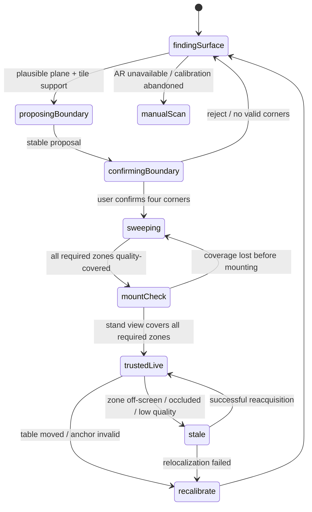
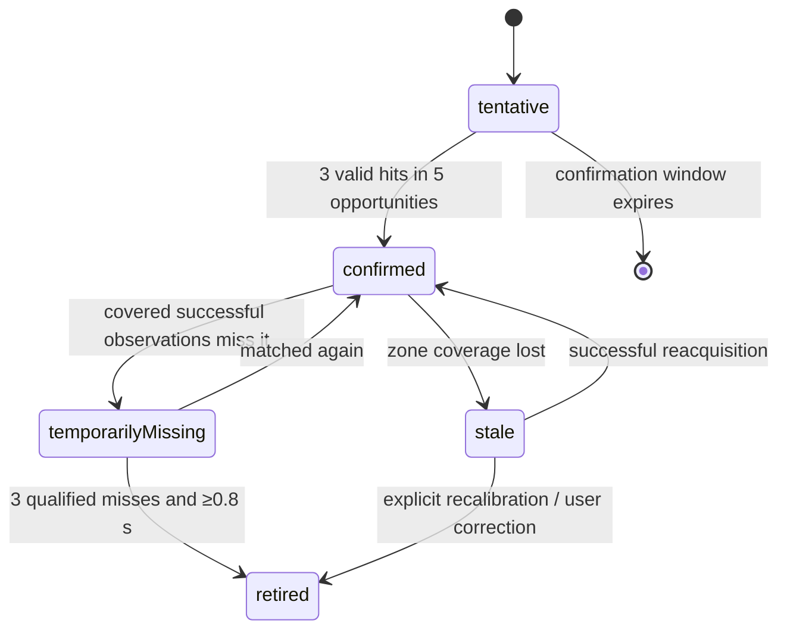

# Coach Live v2.5 — Trustworthy Table Census Technical Design

*Status: proposed, 2026-07-19. Successor to Coach Live v2. This document is the implementation
contract for the next iteration; it does not describe the current build.*

Coach Live v2.5 has one job: determine which visible face-up tiles belong to the user (**MINE**),
which visible face-up tiles have been revealed by other players or discarded (**TABLE**), and
maintain trustworthy per-face counts for both buckets.

Coaching, discard recommendations, turn attribution, hand-boundary inference, and event
reconstruction are explicitly not v2.5 release goals. Existing engines may continue consuming a
census, but they must not make the capture path more permissive or turn uncertainty into invented
state.

---

## 1. Executive decisions

| Decision | v2.5 contract |
|---|---|
| Operating mode | Guided sweep, then portrait stand-mounted capture |
| Supported device | iPhone 15 or newer, iOS 26+, rear wide camera |
| Table setup | Adequate light; user hand and all relevant revealed/discard zones visible after mounting |
| Calibration | App proposes a table quadrilateral; user must confirm and may drag all four corners |
| Spatial model | Calibrated polygon and zones in anchor-local metres, not a fixed square |
| Recognition | Two stage: class-agnostic tile locator, then high-resolution tile-face classifier |
| Prototype locator | Existing 43-class YOLO boxes with their class labels discarded |
| Release locator | Retrained one-class `tile` YOLO |
| Classifier | 43 trained outputs: 42 HK faces plus `back`; `unknown` is rejection, not a class |
| Output | Confirmed MINE/TABLE multisets plus unresolved and stale state |
| Off-screen state | Stale/unknown; never treated as observed |
| AR failure | Offer existing still-photo scan and correction flow |
| Image-space live fallback | Removed from the trusted v2.5 path |
| Optimization priority | Exact confident census before coaching latency or battery |

The guiding rule is:

> It is better to say “unknown” than to show a confidently wrong count.

That rule applies at every boundary: plane selection, coverage, frame quality, detection,
classification, association, absence, ownership, persistence, and UI.

---

## 2. Why v2 is not a sufficient base

v2 proved that ARKit can provide a stable table coordinate frame and that native-resolution crops
can recover far-tile detail. It did not prove that its state is a trustworthy census. The following
are correctness problems, not tuning details:

1. **The largest horizontal plane can be the floor.** Selection has no table classification,
   plausible height, table boundary, or tile-evidence requirement.
2. **A fixed 0.9 m square is not the observed table.** AR plane centers and extents evolve and do
   not identify the playing surface edges, center, or useful yaw.
3. **A camera frame is not full-table evidence.** Tracks outside the image cannot safely accrue
   misses.
4. **The bounding-box union of two crops invents observed space.** The gap between disjoint crops
   was not inspected.
5. **Recognition failure can become `.empty`.** A model exception must never mean “we looked and
   found no tiles.”
6. **Tracking state handling is incomplete.** Every non-normal AR tracking state invalidates new
   spatial claims, not only `.limited(.relocalizing)`.
7. **A new AR session is a new coordinate frame.** Persisted table-space boxes cannot be restored
   into it without verified relocalization.
8. **One multiclass detector couples localization and face recognition.** If the model does not
   recognize an unfamiliar face design, it may suppress the box, leaving no crop for a better
   classifier.
9. **A bottom-center point plus fixed footprint is not universal.** Flat discards, upright hand
   tiles, racks, tilted tiles, and stacks have different contact geometry.
10. **Face legality and ownership are coupled.** A temporarily wrong face must not move a physical
    track between MINE and TABLE.
11. **Per-tile accuracy is the wrong product metric.** One tile error makes an aggregate inventory
    wrong; exact-census accuracy must be measured directly.

v2.5 keeps the useful AR projection and crop work, but changes the trust model around it.

---

## 3. Supported operating contract

### 3.1 What the user must do

1. Place the phone in portrait and point it at the playing surface.
2. Move slowly while the app proposes and refines a table boundary.
3. Confirm the four table corners, correcting them if needed.
4. Perform one guided sweep until every required semantic zone has quality-qualified coverage.
5. Put the phone on its stand.
6. Adjust the stand until MINE and every relevant TABLE zone are simultaneously inside the
   coverage guide.

The initial sweep creates a baseline and collects better views. It does not grant the camera
knowledge of later off-screen actions.

### 3.2 Trusted steady state

A session is `trustedLive` only while all required zone polygons:

- project in front of the camera;
- are at least 95% inside the captured image, excluding a small edge-safety inset;
- meet minimum projected pixel density;
- are not substantially occluded;
- have a recent successful observation; and
- are based on `.normal` AR tracking.

When a required zone fails:

- keep its last confirmed inventory for continuity;
- mark the zone and affected aggregate as stale;
- stop using absence evidence for that zone;
- show a concrete reposition/rescan instruction; and
- never label the combined census “current.”

The UI may continue showing current MINE while TABLE is stale, or vice versa. Freshness belongs to
each zone and bucket, not one global Boolean.

### 3.3 Unsupported conditions

Live census is unavailable when:

- AR world tracking is unsupported;
- no plausible table plane and polygon can be confirmed;
- the mounted camera cannot cover all required zones;
- lighting or tile pixel density remains below the quality threshold;
- the table moves after calibration; or
- relocalization cannot recover the original anchor.

The recovery action is the existing still-photo/manual correction flow. v2.5 must not silently
fall back to image-space live tracking and present it with the same trust level.

---

## 4. User flow and calibration



### 4.1 Candidate plane selection

`PlaneLockPolicy` becomes `TableCalibrationController`. It keeps every plausible horizontal
candidate long enough to score it instead of immediately locking the largest.

Hard rejection:

- alignment is not horizontal;
- normal differs from gravity-up by more than 10°;
- plane is not below the camera;
- vertical camera-to-plane distance is outside the initial 0.10–0.80 m stand/sweep envelope;
- projected plane is almost entirely outside the camera; or
- usable extent is below 0.55 × 0.55 m.

Initial candidate score:

| Signal | Weight | Meaning |
|---|---:|---|
| AR classification is `.table` | +3.0 | Strong semantic evidence where available |
| Tile footpoints supported by plane | +3.0 × support fraction | Detector evidence lands consistently on the surface |
| Candidate stability over 2 s | +2.0 | Center, normal, and extent stop moving materially |
| Plausible table area | +1.5 | Saturates around a 0.8–1.2 m square |
| Projected center/coverage | +1.0 | Candidate is where the user is aiming |
| Height near edge of envelope | −1.0 | Floor and tiny raised surfaces are less likely |

Weights are starting values and must be recorded in device logs. Lock requires:

- the same candidate to lead for at least 2 seconds;
- score at least 5.0;
- score margin at least 1.0 over the runner-up; and
- either `.table` classification or at least three supported tile detections.

The user confirmation remains mandatory even when confidence is high.

### 4.2 Table quadrilateral proposal

The proposal is built in plane-local metres:

1. Start with `ARPlaneAnchor` boundary geometry when present.
2. Raycast the bottom-center and lower box corners of detected tiles onto the candidate plane.
3. Reject tile intersections farther than 3 cm from the plane model or outside the plane boundary
   by more than 8 cm.
4. Compute an oriented minimum-area rectangle around the union of supported plane boundary and
   tile evidence.
5. Expand tile-only bounds by 8 cm so edge tiles are not clipped.
6. Clamp the proposal to plausible dimensions of 0.60–1.40 m per side.
7. Yaw-align the local frame so +Z points toward the user’s confirmed edge.

If plane geometry and tile evidence disagree, show the lower-confidence proposal with all four
handles. Never average them into an unexplained result.

Each drag handle is mapped back to the plane with the same `ARFrame` intrinsics and camera pose
used to render it. A corner that cannot raycast onto the selected plane is invalid and cannot be
confirmed.

### 4.3 Semantic zones

Calibration produces polygons, not fixed normalized rectangles:

- `mineHand`: user-edge hand band;
- `mineMeld`: user-edge exposed-meld pockets;
- `tablePond`: central discard area;
- `tableRevealedLeft`, `tableRevealedFar`, `tableRevealedRight`: opponent-edge face-up areas;
- `ignoredWall`: optional wall/face-down region; and
- `boundaryUnresolved`: a narrow ownership uncertainty band between MINE and TABLE.

The setup UI lets the user adjust the user-edge boundary after the four table corners. v2.5 does
not need to distinguish which opponent owns a TABLE tile.

---

## 5. Coordinate and coverage model

### 5.1 Coordinate spaces

| Space | Purpose |
|---|---|
| Native captured pixels | Cropping and sharpness/exposure measurements |
| Oriented normalized image | Vision boxes, preview overlays, coverage projection |
| Anchor-local metres | Calibration polygons, physical association, ownership |
| Tile-crop pixels | Face-classifier input and best-view cache |

Every `TileObservation` carries a `frameID`. Intrinsics, camera transform, image resolution,
orientation, crop map, and pixels must originate from that same `ARFrame`. Camera motion does not
make such a projection stale by itself; mixing pixels from one frame with the pose from another
does.

### 5.2 Coverage is a set, not a bounding box

```swift
struct CoverageMask: Sendable {
    var regions: [ObservedPolygon]
}

struct ObservedPolygon: Sendable {
    var zoneID: SemanticZoneID
    var vertices: [SIMD2<Float>]       // anchor-local metres
    var frameID: FrameID
    var observedAt: TimeInterval
    var quality: FrameQuality
}
```

Two disjoint crops remain two polygons. Miss processing tests the track footprint against each
polygon independently. No AABB union may bridge an unobserved gap.

For a full camera frame, coverage is the intersection of:

- the camera frustum projected onto the table plane;
- the calibrated table polygon;
- quality-valid pixels; and
- non-occluded usable image regions.

“Full frame” therefore never means “full table.”

### 5.3 Tile footprint

A single bottom-center ray remains a useful seed for upright tiles, but is not enough to represent
all poses. v2.5 stores:

- image bounding box;
- one or more plane-intersection candidates from the lower edge;
- estimated anchor-local center;
- footprint covariance/uncertainty;
- pose hint: `flat`, `upright`, `stackedOrOccluded`, or `unknown`; and
- whether the footprint is safe for ownership and absence decisions.

The first locator is one-class, so pose hints initially come from semantic zone, aspect ratio,
lower-edge consistency, and multi-frame geometry. A later geometry-aware locator may replace this
heuristic without changing the census interfaces.

---

## 6. AR capture and frame-quality gate

### 6.1 Video format

At session start:

1. Prefer an `ARWorldTrackingConfiguration.supportedVideoFormats` entry at 1920×1440 and at least
   30 fps.
2. If unavailable, choose the highest pixel-count format at 30 fps or better that remains within
   the device profile.
3. Keep preview rendering at 30 fps.
4. Run inference on the untouched native `capturedImage`; never infer from the preview surface.

Upscaling cannot recover missing detail. The accuracy gain comes from projecting a useful zone,
cropping its original pixels, and only then resizing that smaller crop to the model’s 640×640
input.

### 6.2 Frame-quality contract

```swift
struct FrameQuality: Sendable {
    var trackingIsNormal: Bool
    var sharpness: Float
    var exposureScore: Float
    var clippingFraction: Float
    var projectedPixelsPerTile: Float
    var coverageFraction: Float
    var accepted: Bool
    var rejectionReasons: Set<FrameRejectionReason>
}
```

A frame is ineligible for spatial inference if AR tracking is anything other than `.normal`.
Classifier candidates are deferred when:

- the tile crop is clipped by the sensor edge;
- native short side is below the device-tuned minimum (start at 24 px for localization and 32 px
  for classification);
- focus/sharpness is below the calibrated threshold;
- highlights or shadows destroy too much face detail;
- the tile is substantially occluded; or
- crop mapping fails.

Thresholds must be calibrated from labeled device frames. They must not be tuned only against the
training set.

### 6.3 Motion

Do not reject a frame solely because the phone is moving during the guided sweep. If the pixels,
pose, and intrinsics are from the same `ARFrame`, tracking is normal, and the image is sharp, it is
valid census evidence. Camera angular/linear speed remains a useful predictor of blur and can
lower the best-view score.

Steady-state mounting should make this mostly irrelevant. Event inference remains out of scope.

---

## 7. Two-stage on-device recognition

```mermaid
flowchart LR
    AR["ARFrame"] --> Project["Project calibrated zones"]
    Project --> Quality["Coverage + quality gate"]
    Quality --> ZoneCrop["Native zone crop"]
    ZoneCrop --> Locator["Stage 1: tile locator<br/>640×640"]
    Locator --> Map["Map boxes to native full image"]
    Map --> TileCrop["Padded native tile crops"]
    TileCrop --> Classifier["Stage 2: face classifier"]
    Classifier --> Views["Best-view + temporal fusion"]
    Views --> Plane["Project footprint to table"]
    Plane --> Census["Associate + MINE/TABLE census"]
```



### 7.1 Stage 1: `TileLocating`

```swift
protocol TileLocating: Sendable {
    func locate(in region: LocatorInput) async throws -> [TileLocalization]
}

struct TileLocalization: Sendable {
    var box: TileBoundingBox
    var confidence: Float
    var poseHint: TilePoseHint
}
```

The prototype adapter wraps `VisionRecognizer`, ignores the predicted face, and uses only its box
and confidence. The adapter must also retain `back` boxes; current decoding drops them.

This prototype is for integration only. The production locator is YOLO26n trained with one class,
`tile`. Its Core ML contract is:

- input: portrait-oriented image, letterboxed to 640×640;
- output: up to 300 `[x1, y1, x2, y2, confidence, classIndex]` rows;
- class index: always 0;
- compute: `.cpuAndNeuralEngine`;
- overlap suppression: class-agnostic, initial IoU 0.55; and
- coordinates mapped back through explicit letterbox and crop transforms.

The release build must not depend on the old model recognizing a face before it emits a box.

### 7.2 Stage 2: `TileClassifying`

```swift
protocol TileClassifying: Sendable {
    func classify(_ crop: TileCrop) async throws -> TileFaceHypothesis
}

struct TileFaceHypothesis: Sendable {
    var probabilities: [TileFace: Float] // 42 faces + back
    var topFace: TileFace?
    var confidence: Float
    var margin: Float
    var rejectionScore: Float
}
```

Target model: MobileNetV3-Small or EfficientNet-Lite0, Core ML/ANE, 224×224 or 256×256 input,
single-digit megabytes after quantization. Final selection is empirical: choose the smallest model
that passes held-out physical-tile tests.

Training crops must include:

- 8–15% context padding;
- brightness, white-balance, shadow, glare, mild blur, compression, and sensor-noise augmentation;
- full 0–360° rotation support where table tiles may be sideways;
- perspective and scale changes representative of near hand and far pond;
- partial occlusion examples;
- `back` examples; and
- hard negatives for crop failures.

The 43-output softmax is not enough to identify out-of-distribution tiles. `unknown` is derived
from calibrated top probability, top-two margin, temporal disagreement, and an OOD/rejection
score. Thresholds are selected against a held-out real-table set to minimize confident errors.

### 7.3 Native per-tile crops and best views

Each locator box is expanded by 10% initially, clamped to the native source crop, and extracted
before classifier resizing. Preserve the unscaled crop long enough to compute quality.

Each physical track keeps at most three best views. Score candidates using:

```text
bestViewScore =
    0.30 × normalizedPixelArea
  + 0.30 × sharpness
  + 0.20 × exposureScore
  + 0.15 × frontalness
  + 0.05 × unclippedMargin
```

Replace the lowest stored view only when the candidate is meaningfully better. Classifier fusion
runs over stored best views, not every blurry frame.

Plane homography rectification is an experiment for confirmed flat tiles only. Upright, racked,
or stacked tiles must use their native perspective crop; applying table-plane rectification to
them damages the face.

### 7.4 Short-lived Vision tracking

After a locator acquisition, `VNTrackObjectRequest` may propagate image boxes for at most five
frames or 0.5 seconds, whichever comes first. Reacquire immediately when:

- tracker confidence falls below 0.60;
- box scale or aspect ratio changes implausibly;
- AR projection jumps;
- the crop exits valid coverage; or
- local motion indicates a manipulation.

A failed Vision tracker is not absence evidence. It only schedules detector reacquisition.

This follows the useful acquisition/continuity pattern demonstrated by the AR drawing prior art,
without treating its finger-raycast heuristics as a production table detector.

---

## 8. Observation semantics

The recognition loop must make failure impossible to confuse with an empty scene.

```swift
enum ObservationOutcome: Sendable {
    case success(ObservationBatch)
    case skipped(SkipReason)
    case failed(ObservationFailure)
}

struct ObservationBatch: Sendable {
    var frameID: FrameID
    var observations: [TileObservation]
    var coverage: CoverageMask
    var quality: FrameQuality
}
```

Examples:

| Outcome | May add hits? | May add misses? |
|---|---:|---:|
| Successful crop with detections | Yes | Yes, inside its exact coverage polygons |
| Successful crop with zero detections | No | Yes, inside its exact coverage polygons |
| Locator/classifier threw | No | No |
| Pixel crop failed | No | No |
| Tracking not normal | No | No |
| Crop quality rejected | No | No |
| Zone off-screen | No | No |
| Vision object tracker lost target | No | No |

The current pattern of catching `recognize()` and assigning `.empty` must be removed from the
trusted pipeline.

---

## 9. Physical association and face fusion

### 9.1 Association

Replace greedy association with deterministic bipartite matching. Candidate cost combines:

- anchor-local center Mahalanobis distance;
- footprint overlap;
- image-space continuity;
- pose compatibility; and
- similarity between face probability distributions.

Ownership is not part of the cost; it is derived after matching from the calibrated geometry.

Hard gates reject physically impossible matches. The Hungarian solve is small—normally fewer than
80 visible tiles—and is negligible beside inference.

### 9.2 Track lifecycle



Only qualified successful observations count as “opportunities.” Time passing, failed inference,
off-screen state, or low Vision-tracker confidence does not advance retirement.

### 9.3 Face fusion

For every confirmed physical track:

- accumulate log probabilities from accepted best views;
- weight by classifier calibration and crop quality;
- decay very old evidence after a physical manipulation;
- publish a face only after minimum evidence and margin are met;
- require stronger evidence to switch an already-published face; and
- keep user corrections pinned until the physical track retires.

Conflicting high-quality views move the track to `unresolved`; they do not alternate the public
count frame by frame.

---

## 10. Ownership and census

### 10.1 Ownership is geometric

```swift
enum CensusBucket: Sendable {
    case mine
    case table
    case ignored
    case unresolved
}
```

Initial rules:

- center/footprint inside `mineHand` or `mineMeld` → MINE;
- inside pond or opponent revealed polygons → TABLE;
- `back` inside the wall or opponent concealed region → ignored;
- face-up detection outside every calibrated semantic zone → unresolved;
- footprint crossing an ownership boundary beyond tolerance → unresolved.

Face identity never decides ownership. This prevents a wrong face prediction from moving a tile
between buckets.

### 10.2 Census output

```swift
struct CensusSnapshot: Sendable {
    var mine: TileMultiset
    var table: TileMultiset
    var unresolved: [UnresolvedTile]
    var zoneFreshness: [SemanticZoneID: ZoneFreshness]
    var coverage: [SemanticZoneID: Float]
    var confidence: CensusConfidence
    var generatedAt: TimeInterval
}
```

Only confirmed tracks with confirmed visible faces enter `mine` or `table`. `back`, unknown face,
unknown ownership, duplicate conflicts, and stale-only observations remain explicit.

The UI must show:

- confirmed counts;
- number of unresolved tiles;
- which bucket/zones are stale;
- whether the combined census is current; and
- a rescan/reposition action.

It must not fold unresolved tiles into the most likely face merely to make totals look complete.

### 10.3 Conservation

Apply physical constraints after association and face fusion:

- at most four copies of each suited or honor tile across confirmed MINE + TABLE;
- at most one of each flower/season;
- at most 144 physical tiles including backs/ignored tracks;
- one physical TrackID contributes to exactly one bucket; and
- a user correction cannot create a fifth confirmed copy without surfacing a conflict.

Conservation violations downgrade the lowest-confidence conflicting track to unresolved. They are
diagnostic signals for duplicate association or wrong classification, not data to silently clamp.

### 10.4 No event reconstruction in the trusted core

v2.5 publishes current state. It does not use rebirth, inferred claims, or settle-diff events to
modify counts. Optional event logs may be derived downstream, but deleting or rewriting an event
must not mutate the physical census.

---

## 11. Interruption, persistence, and invalidation

### 11.1 AR tracking states

Only `.normal` permits new spatial observations. All `.limited` reasons and `.notAvailable`:

- stop hit/miss ingestion;
- keep the last snapshot as stale;
- retain image crops only if privacy/lifetime policy allows; and
- show a tracking-quality recovery message.

### 11.2 Background and interruption

On a short interruption, attempt relocalization. Resume trusted state only if:

- ARKit reports normal tracking;
- the original anchor is recovered;
- projected calibration control points agree with the camera view; and
- at least three stable physical tracks reacquire within tolerance.

Otherwise invalidate table-space tracks and request a guided sweep. Never deserialize old
anchor-local boxes into a newly created world frame.

Persist winds/settings and the last census for display, but mark the census stale until spatial
reacquisition succeeds. A full process restart defaults to recalibration unless a tested
`ARWorldMap` relocalization path is added later.

### 11.3 Table movement

Detect likely table movement from:

- AR plane transform/normal discontinuity;
- simultaneous coherent displacement of many stable tracks;
- calibration corner reprojection error; and
- loss of plane support.

Do not adapt the anchor invisibly. Freeze the census as stale and require confirmation or
recalibration.

---

## 12. Scheduling, performance, and thermals

Steady-state scheduling is zone- and quality-driven:

- locator acquisition: 2–5 Hz while local motion is present;
- settled verification: approximately 1 Hz;
- short Vision tracking: between acquisitions;
- classifier: only for new tracks, manipulated tracks, unresolved faces, or a materially better
  best view;
- full-table safety pass: only when all required zones fit in the camera and thermal state allows;
  it still carries a computed coverage polygon.

ROI scheduling priority:

1. manipulated unresolved region;
2. MINE;
3. pond;
4. opponent revealed zones;
5. stale-zone verification.

At `.serious` thermal state, lower acquisition cadence and disable nonessential reclassification.
At `.critical`, stop inference, mark data stale, and show cooling status. Never trade a lower
cadence for lower confidence thresholds.

Run a one-hour stand-mounted iPhone 15+ soak while plugged in. Passing means no critical thermal
state, no unbounded buffer growth, no increasing inference queue, and no confident count churn on
a static table.

---

## 13. Package boundaries and migration

`Recognition` remains platform-pure. App-side AR code constructs platform-neutral calibration,
frame, and projection values.

Proposed modules:

| Module | Responsibility |
|---|---|
| App `CoachLive/Capture` | AR session, calibration UX, native crops, Vision short tracking |
| Recognition `Localization` | `TileLocating`, locator adapter, box decoding |
| Recognition `Classification` | `TileClassifying`, classifier adapter, rejection calibration |
| Recognition `Observation` | typed outcomes, coverage polygons, quality metadata |
| Recognition `Census` | physical association, face fusion, ownership, conservation |
| Existing Scan/Score | unchanged `Recognizer` interface and correction overlay |

Migration sequence:

1. Add the new interfaces and adapt current YOLO boxes as a locator.
2. Add native per-tile cropping and a classifier stub/fixture.
3. Replace v2 visible-region rectangles with polygonal `CoverageMask`.
4. Introduce typed outcomes and remove error-to-empty conversion.
5. Add physical census beside the existing `TableTracker`; compare both in debug telemetry.
6. Integrate the real classifier.
7. Swap in the one-class locator.
8. Make the v2.5 census the UI source only after release gates pass.

The Scan/Score path continues using the shipping 43-class detector until separately migrated.

---

## 14. Single-class locator dataset

### 14.1 Why no new labels are required

The canonical v3-fsbal dataset already says where every tile is. Most labels are YOLO boxes:

```text
class_id x_center y_center width height
```

The locator dataset changes only `class_id`:

```text
31 0.42 0.61 0.05 0.12  # original white-dragon box
0  0.42 0.61 0.05 0.12  # one-class tile box
```

Some source rows are valid YOLO polygons (`class_id x1 y1 x2 y2 ...`) rather than five-field
boxes. Those rows are preserved as polygons with only their class id changed; Ultralytics converts
them to detection boxes when training a detection model. Every existing face and `back` becomes
`tile`. Images, geometry tokens, filenames, and split membership stay unchanged.

Canonical source:

```text
Modeling/mjss/data/exports/mjss-hk-mahjong-yolo26-v3-fsbal.zip
```

Generated output:

```text
Modeling/mjss/data/exports/mjss-hk-mahjong-yolo26-v3-fsbal-single-class.zip
```

Expected pairs:

| Split | Images | Labels |
|---|---:|---:|
| train | 24,275 | 24,275 |
| val | 3,467 | 3,467 |
| test | 627 | 627 |

### 14.2 Generate and validate

From `Modeling/mjss`:

```bash
python scripts/make_single_class_locator_dataset.py
```

The utility:

- verifies the exact 43-class source schema and order;
- validates every image/label pair and every normalized box or polygon;
- preserves empty label files;
- rewrites only the class id;
- emits `path: .`, `nc: 1`, `names: [tile]`;
- validates CRCs, output counts, box counts, paths, and all-zero class ids;
- prints source/output SHA-256 hashes;
- enforces the 10 GiB platform limit; and
- writes to a temporary sibling before atomically renaming.

Use `--force` only when intentionally replacing an existing generated archive. The source ZIP is
always opened read-only.

Run the fixture tests:

```bash
python -m unittest discover -s tests -v
```

### 14.3 Local training

```bash
cd Modeling/mjss
source .venv/bin/activate

mkdir -p data/processed/hk_locator_v3
unzip -q \
  data/exports/mjss-hk-mahjong-yolo26-v3-fsbal-single-class.zip \
  -d data/processed/hk_locator_v3

yolo detect train \
  model=yolo26n.pt \
  data=data/processed/hk_locator_v3/data.yaml \
  epochs=100 \
  imgsz=640 \
  batch=16 \
  device=mps \
  patience=30 \
  workers=4 \
  project=runs \
  name=yolo26n-hk-locator-v3
```

Run a 5-epoch smoke train first if the environment or export version has changed. Production
training should retain a truly unseen physical-table test set; the public-source test split alone
is not a release gate.

### 14.4 Ultralytics Platform

1. Upload `mjss-hk-mahjong-yolo26-v3-fsbal-single-class.zip`.
2. Confirm the platform shows exactly one class named `tile`.
3. Confirm the train/val/test image counts above.
4. Train YOLO26n at 640 px for approximately 100 epochs.
5. Download `best.pt` and retain the run metrics/config with the artifact.

### 14.5 Core ML export

Export a model matching the locator adapter instead of the old 43-class decoder:

```bash
python - <<'PY'
from ultralytics import YOLO

model = YOLO("runs/yolo26n-hk-locator-v3/weights/best.pt")
path = model.export(
    format="coreml",
    imgsz=640,
    nms=False,
    half=True,
)
print(path)
PY
```

Before bundling, inspect the `.mlpackage` and assert:

- one input with the expected image size/preprocessing;
- one detector class;
- the expected output tensor shape/coordinate convention;
- Core ML CPU + Neural Engine execution succeeds; and
- Swift decoding matches Python on the same ten golden images.

Do not replace the shipping model merely because training mAP is higher. Compare locator recall
and exact downstream census against the same held-out images and videos.

### 14.6 Later classifier dataset

A separate future utility will read the original 43-class archive, crop each box from its parent
image with context padding, and preserve the original class as the crop label. Requirements:

- split by parent/source image, never randomly by crops;
- prevent augmented siblings or near-duplicates crossing splits;
- discard crops below a documented native-detail floor;
- retain parent image, box, class, source, and crop transform in a manifest;
- add real stand-mounted captures from target tables; and
- keep copyrighted game-sprite datasets excluded.

That classifier dataset is intentionally not generated by the single-class locator utility.

---

## 15. Validation strategy

### 15.1 Model diagnostics

Measure:

- locator precision/recall by distance, zone, pose, lighting, and tile set;
- classifier top-1 accuracy, calibration error, top-two margin, and unknown rejection;
- combined detection + classification accuracy;
- missed-small-tile rate by native pixel size; and
- Core ML latency/compute residency on supported devices.

Model metrics diagnose failures. Product release gates use exact inventories.

### 15.2 Coordinate and semantic tests

Unit tests must cover:

- portrait raw-pixel ↔ oriented-image ↔ crop ↔ full-image round trips;
- asymmetric fixtures that catch x/y swaps and sign errors;
- polygon clipping at image boundaries;
- two disjoint coverage polygons with an unobserved gap;
- partial tile footprint at a coverage edge;
- AR pose/intrinsics taken from the wrong frame being rejected;
- every tracking-limited state;
- failed/aborted/skipped inference producing zero misses;
- successful empty inference producing misses only inside exact coverage;
- ownership independent of face prediction;
- conservation conflict resolution; and
- persistence into a new coordinate frame being rejected.

### 15.3 Recorded-video gold set

Build ground-truth checkpoints and action timelines for:

- the existing `Planning/Mahjong Tables/Videos/IMG_6249.mov`;
- matte and glossy tables;
- at least three physical tile designs not represented by near-duplicate training images;
- normal and dim lighting;
- glare and strong shadows;
- rotated flat discards;
- upright hand tiles and exposed melds;
- racks, stacks, backs, and partial occlusion;
- hands crossing the view;
- phone movement during sweep;
- temporary off-screen zones;
- table movement;
- interruption and successful relocalization; and
- interruption followed by relocalization failure.

Evaluate three configurations on identical frames:

1. current 43-class detector;
2. two-stage pipeline using current boxes;
3. two-stage pipeline using the one-class locator.

### 15.4 Release gates

On supported stand-mounted, adequate-light checkpoints:

| Metric | Gate |
|---|---:|
| Exact MINE multiset | ≥95% |
| Exact TABLE multiset | ≥90% |
| Exact combined multiset | ≥90% |
| P95 time to stable census after visibility/stillness | ≤3 s |
| Critical thermal state in one-hour iPhone 15+ soak | 0 occurrences |

Also report, without hiding them inside accuracy:

- unknown face rate;
- unresolved ownership rate;
- stale-zone duration;
- coverage rejection rate;
- false confident additions/removals;
- face-flip rate;
- duplicate/conservation conflicts; and
- manual correction rate.

A checkpoint with stale required zones is not counted as correct. Report it as unavailable/stale
so conservative rejection cannot game the accuracy metric.

---

## 16. Rollout and observability

### Phase A — Data and interfaces

- Generate and train the one-class locator.
- Add the two-stage interfaces and current-detector locator adapter.
- Add structured frame, crop, and observation identifiers.

### Phase B — Calibration and coverage

- Implement scored plane selection and editable table polygon.
- Store semantic zones in anchor-local metres.
- Replace visible AABBs with coverage polygons.
- Remove AR live fallback to image space.

### Phase C — Census shadow mode

- Run new physical census beside v2 state without changing production UI.
- Record aggregate counters only; do not store camera frames by default.
- Compare snapshots in the device harness and debug HUD.

### Phase D — Trusted UI

- Switch MINE/TABLE counts to `CensusSnapshot`.
- Surface unresolved and stale states.
- Keep still-photo/manual scan one tap away.

### Phase E — Release gate

- Pass gold-video metrics.
- Pass multi-table device sessions.
- Pass one-hour thermal soak.
- Confirm Scan/Score recognition is unchanged.

Useful local, privacy-preserving counters:

- observations by outcome and skip/failure reason;
- quality rejection reasons;
- per-zone coverage/freshness;
- detector acquisitions and Vision tracker handoffs;
- classification accept/reject/flip counts;
- track births, matches, qualified misses, and unresolved conflicts;
- census exactness in labeled harness runs; and
- inference latency and thermal state.

---

## 17. Principal risks

| Risk | Consequence | Mitigation |
|---|---|---|
| Table not fully visible after mounting | Later off-screen changes are unknowable | Full-zone coverage contract; stale UI; reposition/rescan |
| Public data differs from real Toronto tiles | Boxes or faces fail out of domain | One-class locator, crop classifier, real-table held-out set |
| Far tiles contain too few native pixels | No model can recover face detail | Projected density gate, native ROI crops, stand guidance |
| Glare/white dragon ambiguity | Confident face errors | Best-view fusion, exposure gate, unknown rejection |
| AR picks floor or nearby surface | Every ownership result is wrong | Candidate hard gates, tile support, editable confirmation |
| Table or phone moves | Anchor/state mismatch | Reprojection checks, invalidation, reacquisition |
| Occlusion looks like removal | Counts fall incorrectly | Qualified coverage-aware misses only |
| Two crops overlap or have a gap | Duplicates or false absence | Full-image dedup plus independent coverage polygons |
| Classifier corrects labels but locator misses boxes | Exact census cannot recover | One-class production locator release gate |
| Thermal throttling | Latency and skipped observations | On-demand classifier, short tracking, adaptive cadence |
| “Unknown” hides weak performance | Product appears accurate but unavailable | Separate unknown/stale gates and availability reporting |

---

## 18. Non-goals

v2.5 does not promise:

- observing actions outside the camera;
- reading concealed opponent faces;
- identifying the discarding opponent;
- reconstructing exact event order;
- recommending a discard;
- scoring a win automatically;
- working without user table-boundary confirmation;
- supporting arbitrary handheld live use after calibration;
- restoring table-space tracks into an unrelated AR session; or
- fixing poor source detail by digital upscaling.

---

## 19. Prior art and references

- Apple ARKit: world tracking, plane anchors, camera intrinsics, and tracking-state semantics.
- Apple Vision: `VNTrackObjectRequest`, Core ML requests, orientation, and crop behavior.
- Apple Core ML: model deployment and Neural Engine execution.
- [Toptal ARKit drawing tutorial](https://www.toptal.com/developers/arkit/ios-arkit-tutorial-drawing-in-air-with-fingers):
  useful for acquisition/continuity, raycast validity, focus feedback, and session-state UX; not a
  production table-recognition design.
- [oabdelkarim/ARPaint](https://github.com/oabdelkarim/ARPaint): useful implementation reference
  for the same AR interaction pattern and explicit session handling.
- Existing local implementation:
  `App/Sources/Features/CoachLive/Capture`,
  `Packages/Recognition/Sources/Recognition`, and
  `Planning/Coach-Live-v2-Technical-Design.md`.

The main lesson from the AR drawing examples is not “use finger tracking for mahjong.” It is that
AR features become reliable when acquisition, validity feedback, short-term tracking, coordinate
mapping, and failure states are explicit. v2.5 applies that lesson to a conservative physical
tile census.
