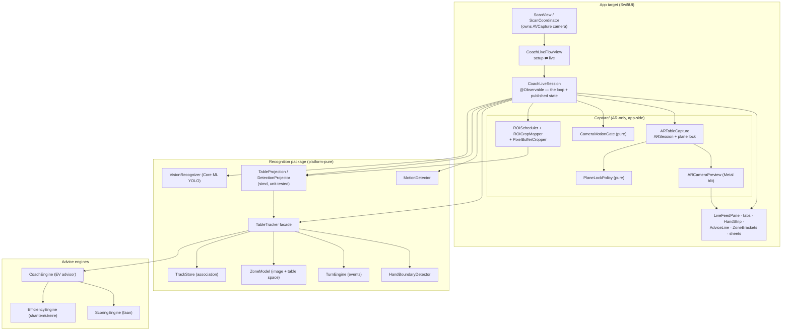
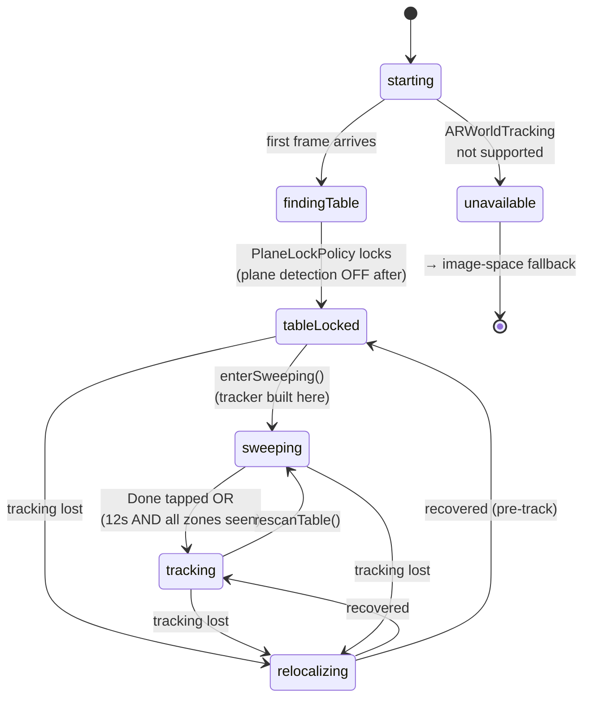
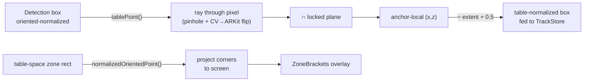
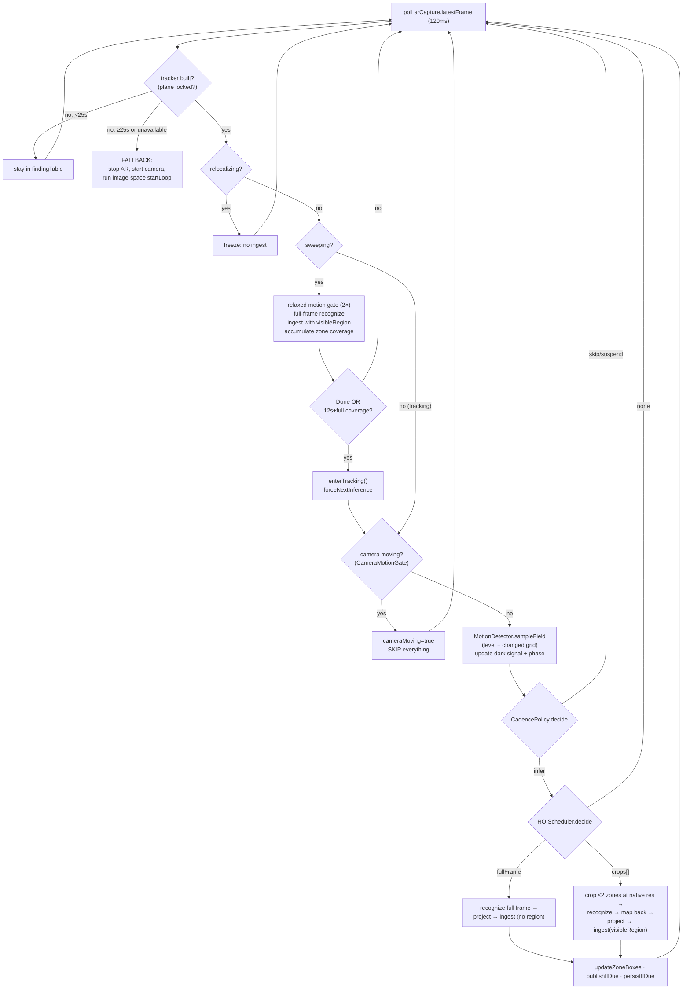
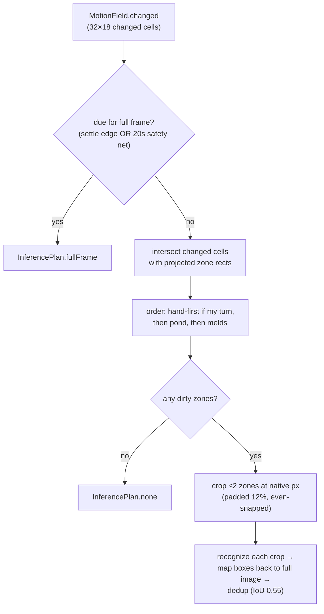
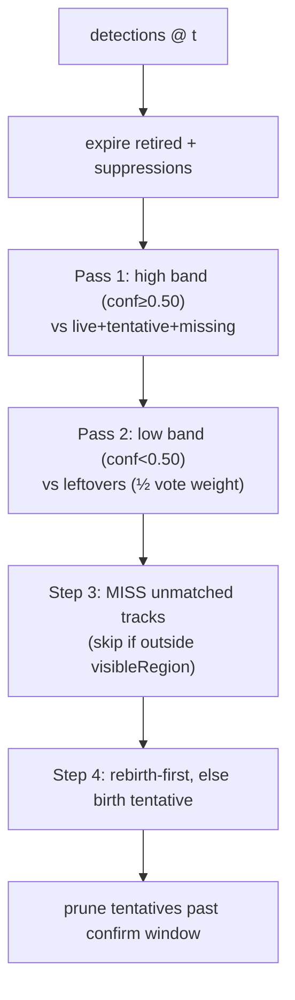
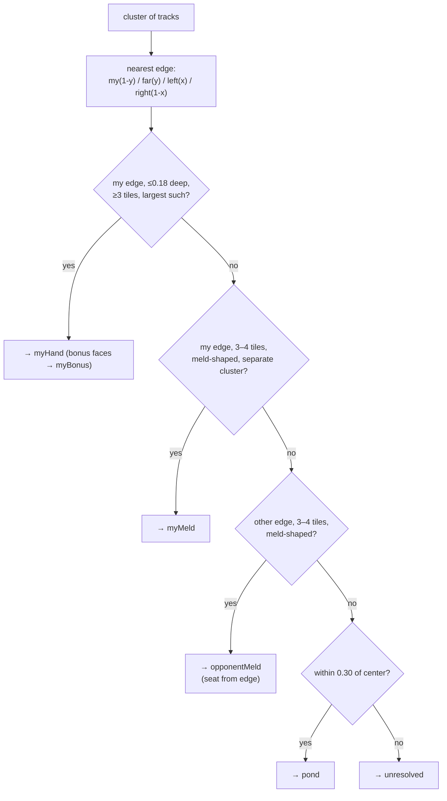
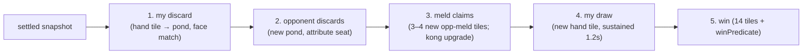
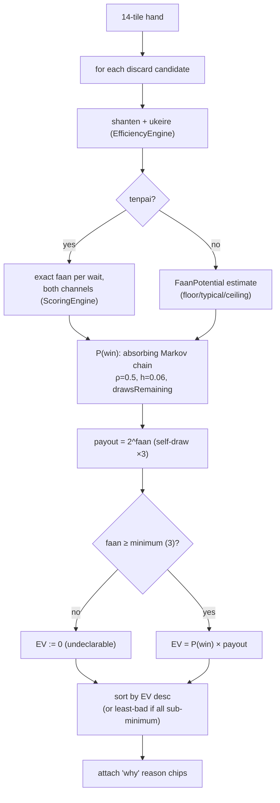
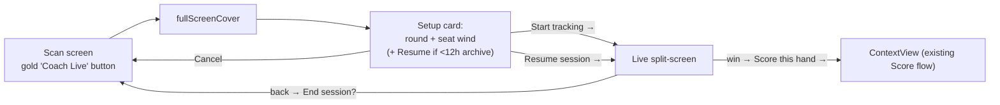

# Coach Live v2 — Full Technical Design

*Status: as-built, 2026-07-18. Uncommitted working tree. Recognition 197 tests green; offline
harness golden byte-identical; sim + device builds succeed.*

This document describes the **current implementation** of Coach Live — the live "watch the game"
table tracker — after the v2 ARKit rebuild. It is written for review: every constant, decision
point, user interaction, and edge case below reflects the actual code, not intent. Sections
flagged **⚠ GAP** or **🔧 TUNE** call out things worth your attention.

---

## 1. What Coach Live is

Point the phone at a Hong Kong mahjong table. Coach Live watches the whole table through the
camera — your hand, the discard pond, opponents' revealed melds — tracks it continuously for
hours, derives an event log (who discarded what), and coaches your discards with real
faan-aware expected value. 100% on-device, iOS 26+, portrait.

The core problem v2 solves: the v1 tracker calibrated zones in **image space**, so the moment you
moved the phone, pond membership and tile counts scrambled. v2 anchors everything to a **world
plane** (ARKit), so the table has a stable coordinate frame that survives any camera movement.

### Two operating modes

| Mode | When | Zone logic | Coordinates fed to tracker |
|---|---|---|---|
| **Table-space (AR)** | ARKit available + a table plane locks | Geometric (physical edges) | Detections projected onto the world plane |
| **Image-space (fallback)** | ARKit unavailable, or no plane locks within 25s | `TableSceneParser` heuristics | Detector's raw normalized boxes |

The image-space path **is the entire v1 pipeline, unchanged** — it is both the offline test
harness path and the live fallback. Everything below that says "AR mode" is additive.

---

## 2. System architecture

**Dependency rule:** `Recognition` never imports ARKit/UIKit. The app projects detections into
table coordinates and hands the tracker synthetic table-space boxes; `TrackStore`/`TurnEngine`
can't tell the difference. `ScoringEngine`'s win check is injected into the tracker as a closure
(`winPredicate`).

---

## 3. Capture lifecycle & plane lock (AR mode)

`ARTableCapture` owns an `ARSession` with `ARWorldTrackingConfiguration` (horizontal plane
detection, `.gravity` alignment, no environment texturing / scene depth). Each `ARFrame` is
snapshotted into a lock-guarded `latestFrame: ARTableFrame` (`{pixelBuffer, cameraTransform,
intrinsics, imageResolution, lightLux, timestamp}`), polled by the loop exactly like the old
`CameraCapture.latestBuffer`.

### CaptureStage state machine

**PlaneLockPolicy** (pure, testable): among candidate horizontal planes within
`lateralRadius = 1.5 m` of the camera's ground point, pick the **largest**; promote to locked
once the *same* plane wins continuously for `stableDuration = 2.0 s` with its center moving
`≤ centerEpsilon = 0.02 m` between frames. On lock it turns plane detection **off** (power) and
**yaw-aligns** the anchor so local **+Z points from the table toward where you were sitting at
session start** — this is the load-bearing contract that makes table-space **+y = "toward me"**,
which every downstream seat/zone rule assumes.

🔧 **TUNE (device):** `stableDuration`, `centerEpsilon`, `lateralRadius`, and the wide-camera FoV
(ARKit forces the wide lens; the old scan path used ultra-wide) all need real-table validation.

⚠ **GAP:** Torch while ARSession runs is done via `AVCaptureDevice.lockForConfiguration` — a
community-proven but undocumented combination. If `lockForConfiguration` throws it silently
no-ops; there's no "torch failed, hide the suggestion" detection yet. Verify on device.

---

## 4. Coordinate systems & projection

Three spaces, and the whole AR pipeline is about moving between them correctly.

| Space | Definition | Origin |
|---|---|---|
| **Captured pixel** | Raw sensor buffer, always landscape | top-left, +x right, +y down |
| **Oriented-normalized** | Captured buffer rotated `.right` 90° CW → portrait, normalized [0,1] | top-left; this is `DetectedTile.box`'s space |
| **Table anchor-local** | Plane surface (local y=0), packed `(x, z)` | plane center at **(0.5, 0.5)** after normalization; +y grows toward me |

`TableProjection` (pure simd, unit-tested with asymmetric fixtures that catch x/y swaps and sign
flips) holds the forward and inverse maps:

- **`DetectionProjector`** projects each tile's **bottom-center** (the point touching the table
  for an upright tile) to anchor-local, normalizes by `tableExtent = 0.9 m` to put the anchor at
  (0.5, 0.5), and synthesizes a **fixed physical footprint** box (`24×32 mm ÷ extent`). Tiles
  whose ray misses the plane or lands behind the camera are dropped.
- Brackets run the **inverse** each publish: table-space zone rectangles → screen, so the
  existing `ZoneBracketsOverlay` + `AspectFillMapping` render unchanged.

---

## 5. The per-frame loop (the crux)

The loop polls every **120 ms**. AR mode (`startARLoop`) and fallback (`startLoop`) share
`finishTick` (publish + poll sleep) but differ in everything between.

**Key decision points and their constants:**

- **Never-locks fallback:** if no plane locks within **25 s** (or ARKit is unavailable), tear down
  AR and run the image-space loop verbatim. One-way — a session never re-attempts AR mid-flight.
- **Camera-motion freeze** (`CameraMotionGate`, ring of 4 poses): linear **> 0.12 m/s** or angular
  **> 25°/s** ⇒ *moving* ⇒ skip motion sample, cadence, inference, and ingest entirely; show
  "Hold steady…". On the moving→still edge, force one full-frame inference and re-project brackets.
- **Local-motion settle gate** (`MotionDetector`, unchanged from v1): a 32×18 luma-diff grid;
  `level ≥ 0.045` = "in action", commits only after `settleDelay = 0.7 s` below `0.02`. This still
  distinguishes a *hand moving tiles* from a *still table*, independent of the camera-motion gate.
- **Cadence** (`CadencePolicy`): ~1 Hz idle, ~5.5 Hz burst, settle-burst after motion, suspend on
  thermal critical.

🔧 **TUNE (device):** the two `CameraMotionGate` thresholds are explicitly marked "tune on device"
— too tight and normal hand tremor freezes tracking; too loose and moving the phone scrambles state.

---

## 6. Smart ROI inference (native-resolution crops)

Running full-frame YOLO every tick is wasteful (multi-hour thermal) and low-recall (everything
letterboxes to 640 px, so far pond tiles fall below detectable size). The scheduler infers **only
changed zones, at native resolution**.

**The subtle correctness point — partial views.** A cropped inference only *looked at* part of the
table, so it must not mass-retire the tiles it didn't look at. `TableTracker.ingest(visibleRegion:)`
(new) gates the miss/retire logic: a track whose box lies **outside** the visible region accrues
zero miss progress this tick. The visible region for a crop tick is the union of the crops'
table-space rectangles; full-frame ticks pass `nil` (full view). The fallback path never passes it.

Safety net: a **full frame at least every 20 s** and on every camera-move settle, to catch slow
changes the coarse grid missed and correct drift.

🔧 **TUNE (device):** the recall win vs full-frame, the 0.55 dedup threshold, the 12% padding, and
the net thermal effect (more model invocations but far fewer pixels) are all unproven off-device.

---

## 7. Tracker core

### 7.1 Association (TrackStore)

- **Match gate:** `IoU ≥ 0.30` OR center distance `≤ 0.75 × box diagonal`; greedy, deterministic
  ordering (no Hungarian).
- **Promotion:** tentative → live after **3 hits within 5 ingests**; else it dies silently.
- **Miss → retire:** live → missing (stamped), retired after a grace of **2.0 s** (calm) or
  **6.0 s** (recent motion). Retired tracks linger in a rebirth ring for **10 s**.
- **Rebirth:** a detection matching a missing/retired track's face within **10 s** and
  `2.5 × diagonal` resurrects it under the **same TrackID** — nudged tiles don't double-count.
- **Face voting:** a 15-observation weighted ring, hysteresis margin **2.0** to flip the published
  face; a pinned (user-corrected) face wins forever.
- **Ghost suppression:** a removed track suppresses births on its box for **5 s**.

### 7.2 Zone classification

**Table-space (AR)** — pure geometry off `TableGeometry {extent 0.9, handBandDepth 0.18,
pondRadius 0.30}`:

**Image-space (fallback)** — `TableSceneParser` finds the "hand cluster" (≥4 tiles, median height
≥ 0.055, scored by size × nearness-to-bottom); everything else is split meld-vs-pond by Mahalanobis
distance from the pond centroid. The **v2 rescue** added here: when the parser finds *no* hand this
frame, a single-row cluster of **≥8 tiles** with mean-Y **≥ 0.55** votes `myHand` instead of
pond-by-default — this kills the "your rank read as POND" bug in fallback mode too.

**Shared vote ledger (both modes):** each track keeps a 9-frame zone-vote ring; the published zone
only flips when a challenger leads by margin **3** (hysteresis against flicker). User zone overrides
lock a track out of voting.

⚠ **GAP:** table-space `myMeld` detection ("a second separate my-edge cluster") is a geometric
approximation, not the structural rank-line decomposition image-space uses. Two separate near-edge
clusters that are really one broken-up hand row could misclassify a hand fragment as a meld.

### 7.3 Event derivation (TurnEngine)

Events are **settle-diff**: nothing commits mid-motion. On each settled frame the engine diffs the
current tile set against the last committed baseline, in strict order:

- **Seat attribution** (opponent discards): softmax over turn-order prior (weight 2.0) + motion
  region (1.0) + pond geometry (0.5); flagged amber below **0.55** confidence. **Turn resync:** if
  observed evidence beats the prior by **1.5**, trust the evidence (opponents' draws are invisible,
  so the turn pointer self-corrects from what's actually discarded).
- **`committedHand`** is tracked by TrackID identity, not count, so a one-frame dropout of a hand
  tile doesn't fabricate a phantom draw or discard.
- **Win** assumes self-draw scoring (the tracker can't tell ron from tsumo) — documented limitation.

⚠ **GAP:** `RevisionReason.turnResync` exists in the enum but is never emitted — the turn pointer
resyncs silently with no event logged. Cosmetic, but worth wiring for the Events tab / debugging.

### 7.4 Hand boundary & wind rotation

- **Proposal:** ≥ **60%** of the tiles ever seen live this hand go missing, **and** ≥ **8** tiles,
  sustained **5 s** → propose "hand ended". Meld immunity is structural (a claim moves ≤4 tiles).
- **Dismiss cooldown (v2 fix):** dismissing suppresses re-proposal for **20 s** *while the same
  tiles stay missing*; a genuinely new missing tile overrides immediately. This fixes the
  "keeps asking next hand" nag.
- **Walk-by auto-cancel:** if ≥50% of the "gone" tiles reappear within 8 s, cancel the proposal.
- **Wind rotation:** dealer repeats on a draw or a dealer win; otherwise the deal passes, seat wind
  cycles, and the round advances every 4 deals. `dealsSinceRoundStart` is explicitly carried, not
  inferred.

---

## 8. Advice engine (CoachEngine)

For a 14-tile hand the advisor ranks each possible discard by **expected value = P(win) × expected
payout**, faan-aware, with a hard minimum-faan guardrail.

Key model constants (`ModelConstants.standard`): discard availability ρ = 0.5, dead hazard h = 0.06,
typical wait = 6, stage ukeire table 20/26/32/36. The advisor runs behind an 8-entry LRU
(`AdvisorCache`).

⚠ **GAP:** the model assumes draw-only progress — no opponent defense and no *your* mid-hand
chow/pung claim modeling (v1, documented). Win payouts always use the self-draw channel.

---

## 9. UI / UX

### 9.1 Flow

The setup card is **the only caller of `session.begin()`** — the v2 fix that made the loop actually
start (production used to skip straight to `.live` with a never-begun session). Start shows instant
"Starting…" feedback since the loop spins up async.

### 9.2 The live split-screen

A breathing split: the camera feed occupies **40–72%** of the height, driven by game phase —
**70%** during action (tiles moving), **40%** while thinking (your turn), **54%** at rest — animated
over 0.9 s. The seam ("DRAG · AUTO n%") is draggable; a manual drag overrides for 10 s then eases
back (or sticks forever if auto-breathing is off in Settings). Under compression the **tab content
shrinks first**; the hand strip and advice line never hide; wait chips fold out last.

### 9.3 Feed chrome (top → bottom)

- **Back** (→ "End the live session?" confirm) · **Torch** toggle.
- **LIVE pill:** `"LIVE · N tiles seen"` normally; `"Starting…"` (spinner) while warming;
  `"LIVE · cooling"` (thermal); `"LIVE · detector unavailable"` (model failed to load).
  **Triple-tap** opens a 9-line debug HUD (loop ticks, motion, cadence tallies, raw detections
  with `code@conf`, tracker live/tentative/missing, `rec:` type + `AR`/`2D` mode, ROI plan, last
  error) — also mirrored to Console.app.
- **One priority chip** (mutually exclusive): `"Hold steady…"` (camera moving) **>**
  `"Pan left to check the pond ←"` (a zone unseen > 45 s, throttled 90 s/zone, not during action)
  **>** `"Dark table — turn on flash?"` (sustained low light; tap = torch, × = dismiss).
- **Startup / sweep overlay** (center card): the staged loading text, then the sweep card
  ("Table found — pan slowly across it once…", progress bar, Done, one-time "keep it plugged in"),
  and "Hold on — re-finding your table…" during relocalization.

### 9.4 Zone brackets

Gold **YOURS · n**, cream **POND · n**, amber **n ? · tap** (one per unresolved tile). The
MINE/POND chips carry a **pencil** and are tappable → confirmation dialog → **bulk zone reassign**
("These tiles are actually my hand" / "…the pond"). Amber brackets → the unresolved-assign sheet.

### 9.5 Tabs, hand strip, advice

- **Map:** seat chips ("North · 13 · concealed"), a center pond cloud (2 newest ringed), an
  unresolved chip.
- **Counts:** the 34-tile grid with seen-pips, a gold **wait ring** on live-wait tiles, dead tiles
  dimmed; **tap a tile → 0–4 stepper** (with a "tap a tile to fix its count" hint line).
- **Events:** newest-first log with verbs and wait-delta chips; **tap a row →** amend actor / tile
  / delete.
- **Hand strip:** your 13+drawn tiles; the recommended discard gets a **gold ring + "DISCARD"
  tag**; tap any tile to fix its face.
- **Advice line:** `"→ tenpai · waits [chips] · 5 live · 4.9% next draw"`, or "watching the
  table…"; tap for the ranked-discard detail sheet.
- A one-time **"Tap any tile, count, or bracket to fix it"** banner shows once ever.

### 9.6 Hand-end & win

One `HandEndedCard` (there is no separate WinBanner) over the state pane while the feed keeps
running. Table-clear: winner picker + predicted next-hand rotation (editable) + "Continue →" /
"Not yet — keep playing". Win: "Winning hand! 自摸/食糊" + **"Score this hand →"** (one-tap handoff
into the existing Score flow, seeding tiles/winds/melds) + "Keep playing".

---

## 10. User decision points

| Where | Decision | Options | Default |
|---|---|---|---|
| Setup card | Round wind | E/S/W/N | East |
| Setup card | Your seat | E/S/W/N | East |
| Setup card | Resume? | Resume session / fresh Start | fresh |
| Feed seam | Split size | drag (10s override or sticky) | auto by phase |
| Torch button / dark chip | Flash | on / off / dismiss suggestion | off |
| Sweep card | End sweep early | Done / keep panning | auto at 12s + coverage |
| Rescan prompt | Re-scan a zone | follow arrow / dismiss | — |
| POND/MINE bracket | Reassign whole zone | my hand ⇄ pond / cancel | — |
| Unresolved bracket | Place a tile | Mine / Table / Not a tile | — |
| Counts tile | Fix seen count | 0–4 stepper | tracked value |
| Hand tile | Fix face | pick tile | tracked face |
| Event row | Fix event | actor / tile / delete | tracked |
| Hand-end card | End hand? | Continue (winner/draw) / keep playing | — |
| Win card | Score or continue | Score this hand / keep playing | — |
| Back button | End session | End / keep watching | — |
| Settings | Feed blur, Auto-breathing | on/off | both on |

---

## 11. Edge cases & how they're handled

| Edge case | Handling |
|---|---|
| Camera moved / picked up | `CameraMotionGate` freezes ingest; "Hold steady…"; re-sync on settle |
| Plane never locks | 25 s fallback to image-space mode (still fully functional) |
| ARKit unavailable (e.g. Simulator) | `.unavailable` → image-space fallback immediately |
| Tracking lost / relocalizing | Freeze ingest; "re-finding your table…"; anchor survives (state is anchor-relative) |
| Tile nudged / occluded briefly | Rebirth under same TrackID within 10 s; missing-grace before retire |
| Cropped inference (partial view) | `visibleRegion` gate stops off-crop tiles being retired |
| Tile panned out of frame during sweep | Sweep passes a per-frame `visibleRegion` (the review-pass fix) so it isn't retired |
| Hand tile dropout for one frame | `committedHand` by identity → no phantom draw/discard |
| Opponent's turn is invisible | Turn pointer resyncs from observed discards (evidence-over-prior) |
| Walk-by clears the table | Hand-end proposal auto-cancels if tiles reappear within 8 s |
| Accidental hand-end dismiss re-nag | 20 s cooldown while same tiles missing |
| Dark table | Sustained-low-light chip suggests torch (never auto-on) |
| Your rank misread as pond | Fixed by table-space geometry; image-space rescue branch; bracket-tap override |
| Detector model fails to load | Pill reads "detector unavailable"; errors surfaced, not swallowed |
| App killed mid-hand | State persisted ≤5 s / on background; setup offers Resume (<12 h) |
| Resume in the wrong coordinate mode | Cross-mode archive rejected → fresh start at saved winds (logged) |
| Thermal pressure | Cadence backs off / suspends; "cooling" pill; ROI reduces pixel load |
| Melded (not self-draw) win | Scored on self-draw channel (documented assumption) |

---

## 12. Persistence & resume

State-export (not internal-dump): `TrackerSnapshot` carries winds, hand index, deal counter, the
event log, and confirmed tiles (id/face/box/zone/seat/timestamps — `.unresolved` excluded). Written
to Application Support throttled ≤ 1/5 s and forced on background; cleared on clean end / fresh
begin (so only a *kill* leaves an archive). On resume, TrackIDs are preserved (so restored events'
track references still resolve) and every monotonic timestamp is remapped to the new process clock
so "time ago" stays correct. A resumed session briefly shows `.calibrating` — zones recalibrate
from fresh frames rather than restoring vote rings.

---

## 13. Known gaps & tuning knobs (review focus)

**⚠ Semantic gaps / half-wired:**
1. Table-space `myMeld` is a geometric approximation vs image-space's structural decomposition.
2. `RevisionReason.turnResync` declared but never emitted (silent turn resync).
3. Win detection always assumes self-draw scoring.
4. Advice model has no opponent-defense / mid-hand-claim modeling.
5. Torch-over-ARKit unverified; no failure detection.
6. Zone "seen" for staleness = "≥60% on-screen during any inferred tick", not "actually recognized
   that zone" — an approximation.

**🔧 Device-tuning knobs (all constants, no redesign):**

| Knob | Current | Affects |
|---|---|---|
| `CameraMotionGate` linear / angular | 0.12 m/s / 25°/s | freeze sensitivity |
| Sweep relaxed factor | 2× | how fast you can pan during sweep |
| `PlaneLockPolicy` stable / epsilon / radius | 2 s / 0.02 m / 1.5 m | lock speed & pickiness |
| `TableGeometry` band / pond radius | 0.18 / 0.30 | zone boundaries at real FoV |
| ROI crop cap / padding / dedup IoU | 2 / 12% / 0.55 | recall vs cost |
| `fullFrameInterval` | 20 s | drift-correction cadence |
| Staleness / re-prompt | 45 s / 90 s | rescan nagginess |
| Dark thresholds (lux / luma) | 300·450 / 40·60 | torch suggestion trigger |
| `handEndDismissCooldown` | 20 s | hand-end nag |

---

## 14. Device QA checklist

1. Setup → Start → does a table lock within a few seconds; does the sweep card guide sensibly?
2. Sweep once, prop the phone: pond census holds; brackets stay glued to the table when you
   deliberately pick up and move the phone; "Hold steady…" shows while moving; **counts don't churn**.
3. Triple-tap the LIVE pill: HUD `AR`/`2D` mode + `roi:` plan — report if anything misbehaves.
4. Dim room → torch chip; **torch while ARKit runs** is the unverified API.
5. Far pond tiles: does ROI native-res crop read tiles full-frame missed?
6. Force-kill mid-hand → relaunch → Resume.
7. Long session: watch thermals (ARKit is heavier; ROI is the offset). Keep plugged in.
8. Rescan prompts: do the arrow directions point the right way?
