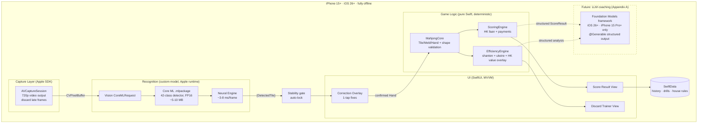
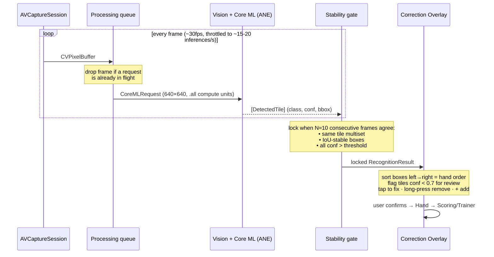
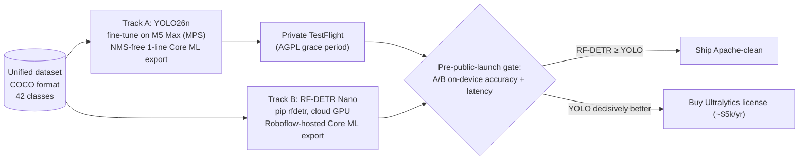
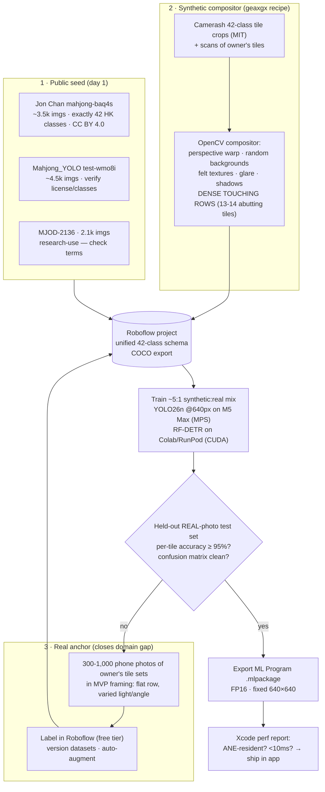
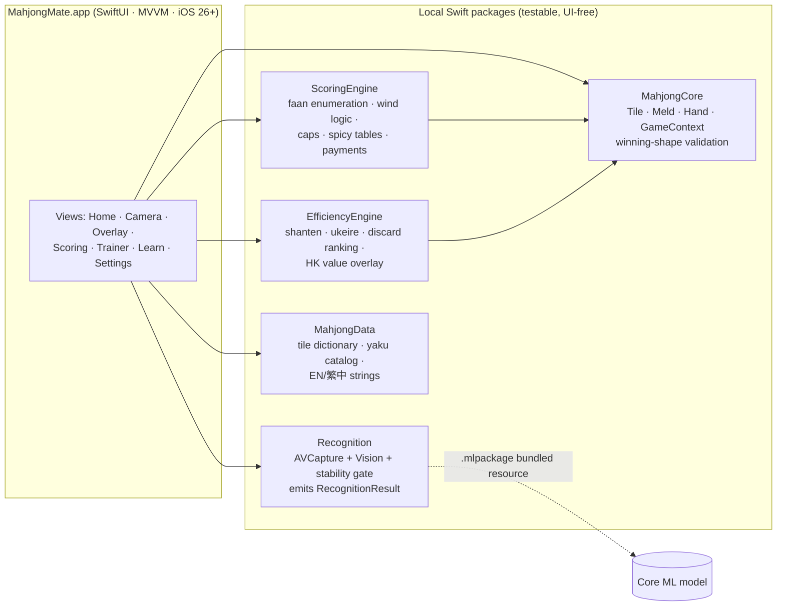
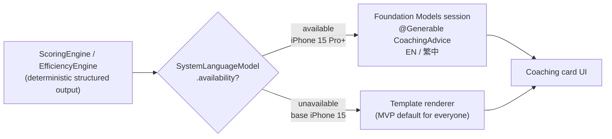

# MahjongMate — On-Device Recognition & AI Stack
## Detailed Technical Implementation Plan (v1.0, July 2026)

> **Purpose of this document:** a self-contained implementation brief that can be handed to an engineer or fed to an LLM as context for building any part of the system. It captures all research findings, decisions, architecture, pipelines, and references. Companion to `Planning/MahjongMate-PRD.md` (product spec). On approval, save a copy to `Planning/Implementation-Plan.md` in the repo.

---

## 0. Decisions locked (from PRD + Q&A with owner)

| Decision | Value |
|---|---|
| Platform / floor | iOS **26+**, all iPhone 15 and newer (incl. base A16) |
| Everything local | Yes — no backend, no cloud inference, no per-request cost, images never leave device |
| Detector runtime | **Core ML on the Neural Engine** via Vision (NOT MLX — see §2) |
| Detector model | **Track A now:** YOLO26n fine-tune (latest Ultralytics, NMS-free; private TestFlight). **Track B before public launch:** RF-DETR Nano (Apache-2.0) retrained on same dataset, or buy Ultralytics license |
| Data strategy | Public datasets + synthetic compositing first; a few hundred real photos of owner's tiles as domain anchor |
| Training hardware | M5 Max 36GB Mac (MPS) for YOLO loops; cloud GPU (Colab/RunPod) for DETR-family runs |
| Scan UX | Live camera view, continuous detection, auto-lock on stable frame |
| Coaching (MVP) | Deterministic template text from engines. LLM = future phase, Apple Foundation Models (Appendix A) |
| Team context | Solo focused sprint |

---

## 1. Why a custom model is unavoidable (Apple SDK gap analysis)

Verified against iOS 26 SDK + WWDC 2026 announcements: **no built-in Apple API can recognize mahjong tiles.**

| Apple API considered | Verdict | Reason |
|---|---|---|
| Vision built-ins (`ClassifyImageRequest`, `DetectRectanglesRequest`, animal/human/pose/barcode requests) | ❌ | Fixed ~1,300-label generic taxonomy; no custom classes; nothing tile-like ships built-in through iOS 26 |
| Translation framework | ❌ | Translates text strings between languages; never touches images |
| Vision OCR / `RecognizeDocumentsRequest` (iOS 26) | ❌ (partial at best) | Might read 萬-suit numerals; cannot read dots/bamboo/flowers; no tile localization; unreliable on stylized glyphs at game distance |
| ARKit 3D object scanning (`ARReferenceObject`; WWDC26 Create ML reference objects) | ❌ | Recognizes one *specific scanned object instance* by 3D point cloud. All 144 tiles share identical geometry — only the printed face differs. Cannot classify 42 classes across a dense row |
| VisionKit (`DataScannerViewController`, Live Text) | ❌ | Closed text/barcode pipeline, not extensible |
| Create ML object detection | ⚠️ prototype only | The one pure-Apple *training* path (zero license risk), but fixed YOLOv2-era architecture → weak on 42 fine-grained lookalike classes (7s/8s, flowers/seasons). Use only to validate the dataset pipeline in a weekend |

**What Apple DOES provide (≈90% of the system):** AVFoundation (camera), Vision (`CoreMLRequest` inference plumbing), **Core ML + Neural Engine** (model runtime), SwiftUI/SwiftData (app), Foundation Models framework (future LLM coaching), ARKit (Phase-2 overlay polish). **What we bring:** one trained 42-class detector (~5–10 MB) + pure-Swift game engines.

---

## 2. System architecture



**The "MLX question" answered per component:**

| Component | Runtime | Rationale |
|---|---|---|
| Tile detector | **Core ML → Neural Engine** | ANE = lowest latency & power; nano detector ~3 ms on A17 Pro, 30–60 fps even on base iPhone 15 (A16). **MLX cannot be used here:** it runs on GPU via Metal only, has no ANE access (no public ANE API exists outside Core ML), and no CV deployment story on iOS |
| Scoring / efficiency | Pure Swift | Deterministic, unit-testable, microseconds, bilingual template output |
| LLM coaching (future) | **Apple Foundation Models** (free, offline); MLX Swift only as a fallback for ineligible devices | See Appendix A. MLX's only iOS niche is GPU LLM inference |

---

## 3. Recognition pipeline (live view + auto-lock)



Implementation notes:
- iOS 26 floor → use the modern Swift Vision API (`CoreMLRequest`, async/await); no `VNCoreMLRequest` legacy path needed.
- `MLModelConfiguration.computeUnits = .all`; verify ANE residency with **Xcode Core ML Performance Report / `MLComputePlan`** — this is the acceptance test for "runs on Neural Engine."
- Throttle to 15–20 inferences/s: battery/thermal headroom, latency budget is ~50 ms/frame vs ~3–8 ms actual.
- **No ARKit for MVP.** Screen-space overlay on the preview layer (Vision normalized-rect → layer coords) is cheaper and more robust for a flat hand. Revisit ARKit plane anchoring for the Phase-2 live table view. WWDC26 ARKit object tracking (Create ML reference objects) suits the *table/rack*, never individual tiles.
- Latency budget end-to-end (capture→decode→NMS): 8–15 ms on A17/A18, slightly more on A16 — all comfortably real-time.

---

## 4. Detector model selection

### 4.1 Landscape (researched July 2026)

| Model | License | Params (nano) | COCO mAP | Core ML / ANE story | Verdict |
|---|---|---|---|---|---|
| **YOLO26n** (Ultralytics, late 2025) | ⚠️ AGPL-3.0; enterprise ≈ $4.5–5k/yr | ~2.4M | ~40 | Best-in-class tooling; **NMS-free end-to-end** → simplest Core ML export (no NMS graph needed), lower device latency; same `device="mps"` training | **Track A** (prototype/TestFlight) |
| YOLO11n (Ultralytics) | ⚠️ same AGPL regime | 2.6M | ~39.5 | One-line export w/ NMS baked in; ~3 ms ANE, 85 fps reported | Fallback if YOLO26 tooling hiccups |
| **RF-DETR Nano** (Roboflow) | ✅ Apache-2.0 (code+weights, Nano–Large tier) | 30.5M (DINOv2-S backbone) | **48.4** | No deformable attention → ANE-friendly; self-serve export has op gap (issue #318); Roboflow hosted conversion + Swift SDK works | **Track B** (public launch) |
| **D-FINE-N** | ✅ Apache-2.0 | **4M** | 42.8 | ONNX official → coremltools; deformable attn (`grid_sample`) tends to run GPU not ANE | Backup to Track B |
| **DEIMv2 Pico/N** | ✅ Apache-2.0 (Atto–N; S+ uses Meta DINOv3 custom license) | 1.5–3.6M | 38.5–43.0 | Same deformable-attn caveat; in HF transformers | Watch |
| RT-DETRv2 | ✅ Apache-2.0 | ~20M | 46.5 | Known Core ML conversion friction | Skip |
| YOLOX / DAMO-YOLO | ✅ Apache-2.0 | 0.9–8.5M | 25–47 | Clean CNN, 100% ANE | Stale (unmaintained since ~2023) |
| YOLO-NAS | ❌ restrictive weights license (Deci/NVIDIA) | 19M | 47.5 | — | Disqualified |
| Create ML (Apple) | ✅ zero risk | fixed arch | low | Perfect Vision integration | Dataset-validation prototype only |

**AGPL reality:** Ultralytics' official position is that *trained weights inherit AGPL even if you train from scratch with their pipeline*; legally contested but untested, and AGPL apps have been pulled from the App Store. Acceptable gray zone during **private TestFlight**; must be resolved (swap or pay) before public release.

### 4.2 Two-track strategy



The **dataset is the durable asset**; models are swappable. Keep everything in COCO format so both trainers consume it unchanged.

### 4.3 Tile class schema (42 classes — matches PRD Appendix A and public datasets)

`1m–9m` characters · `1p–9p` dots · `1s–9s` bamboo · `E S W N` winds · `RD GD WD` dragons · `F1–F4` flowers · `S1–S4` seasons. Watch the confusion matrix for known lookalike pairs: 7s/8s, flowers vs seasons, `RD` vs `1m` (both red characters), `GD` vs `8s`.

### 4.4 Prior art reviewed — `krmin/mahjong_vision` (the downloaded repo)

What landed in `Ref/krmin_mahjong_vision/` is **not** the sprite dataset it was named after (`pjura/mahjong_souls_tiles`); it's the **`krmin/mahjong_vision` model+code repo** — a real-time *desktop bot for the Mahjong Soul video game* (screen-scrape the game window → OpenCV localize tiles in hard-coded pixel regions → ViT-base classifier → discard MLP → auto-click the suggested tile). The folder's files are **dead symlinks**; the real bytes live in `~/.cache/huggingface/hub/models--krmin--mahjong_vision/`. It is riichi (34 classes; custom `1n/1p/1b`, `ew/sw/ww/nw`, `wd/gd/rd` notation), trained on **rendered game sprites**, with **no flowers/seasons/red-fives**. It does **not** change our architecture — but it yields five concrete lessons:

| Takeaway from the repo (verified in source) | What it means for MahjongMate |
|---|---|
| **Two-stage (localize → classify) hit 99.67% test accuracy** on isolated crops with a plain ViT (250-epoch fine-tune) | Validates our two-stage *fallback* (§9): a per-crop classifier is easy to make very accurate. **Caveat:** their localization is classical OpenCV in **fixed screen coordinates on a clean, flat game board** — it will not survive angled/lit photos of physical tiles. Only the *classify* half transfers; our fallback still needs a **learned class-agnostic tile detector** for the *localize* half |
| **Classifier is ViT-base: ~86M params, 327 MB fp32** | A desktop/CUDA choice, ~50× too big for on-device. If we ever run the two-stage path, the crop classifier must be a **nano MobileNetV3 / EfficientNet-lite (single-digit MB)** exported to Core ML — reinforces the §2 nano-on-ANE decision. Don't reflexively reuse an HF ViT |
| **Class indices are ordered alphabetically** (`1b`=0, `1n`=1…), reconciled to game order by a `translate_to_vision` map | Keep a **single source of truth** for the 42-class ↔ index map (in `MahjongData`), consumed by both the exported model's label list and the engines. Mismatched orderings are a classic silent-label bug |
| **Discard advice is an ML model** (`ImprovedNN`, 204-dim game-state → tile; from `pjura/mahjong_ai`, Tenhou-trained) | This is the ML alternative to our deterministic `EfficiencyEngine`. We **keep deterministic for MVP**: it explains *why* (required for a teaching app), honors HK faan values, and is unit-testable. A learned coach stays a Phase-4 "maybe," and even then only to *rank*, never to *explain* |
| **Training images are Mahjong Soul game assets** (Yostar/Catmint) — apache-2.0 covers the author's *code/weights*, not the *artwork* | **Hard exclusion** (see §5, §9): never train our detector on `pjura/mahjong_souls_tiles` or any Mahjong Soul rip for a commercial app — copyright **and** wrong domain (rendered sprites ≠ physical tiles). Also a framing reminder: a game *cheating bot* is exactly the positioning the PRD §4 non-goals avoid for App Review |

**Net:** useful as a negative reference and a validation of two-stage classification accuracy; nothing in it is directly reusable (wrong game/variant, wrong 34-class set, wrong domain, oversized model, copyrighted data).

---

## 5. Dataset & training pipeline



Key evidence from research:
- **Synthetic-only fails on real video** (Aalto thesis, mahjong-specific); mixing ~5:1 synthetic:real restores accuracy. Never ship synthetic-only.
- geaxgx's playing-card compositor (OpenCV only, no Blender) is the proven recipe for rigid planar objects; copy-paste augmentation (Ghiasi et al. 2021) is the supporting literature.
- Public models degrade to ~70% out-of-domain (PRD's concern) — the real-photo anchor set is what fixes this; the correction overlay absorbs the residual.
- M5 Max 36GB: YOLO26n @640 on ~10k images = hours on MPS (`device="mps"`). RF-DETR prefers CUDA (DINOv2 backbone; use `PYTORCH_ENABLE_MPS_FALLBACK` if attempting locally).
- Compression: FP16 is sufficient (already ~3 ms); optionally 6-bit palettization for size. Skip INT8 activation quant — the W8A8 fast path needs A17 Pro+ anyway and base iPhone 15 (A16) must stay supported.
- Attribution: CC BY 4.0 datasets require in-app credit (Settings → About → acknowledgements).
- **Excluded on purpose:** Mahjong Soul / rendered-game-sprite datasets (e.g. `pjura/mahjong_souls_tiles`, and the reviewed `krmin/mahjong_vision` in `Ref/`) — copyrighted game art (Yostar/Catmint) **and** the wrong domain (digital sprites, riichi 34-class, no flowers/seasons). Negative reference only, never training data. See §4.4.

---

## 6. iOS app structure



- Data models: as specified in PRD §9 (`Tile`, `DetectedTile`, `RecognitionResult`, `Meld`, `Hand`, `GameContext`, `HouseRules`, `ScoreComponent`, `ScoreResult`).
- Engines: pure, deterministic, 100%-unit-tested. Reference oracle for the test corpus: `garyleung142857/mahjong-tile-efficiency` (supports HK Old Style). Corpus ≥50 curated hand+context cases per PRD §11.
- Persistence: SwiftData (history, drill stats); HouseRules in SwiftData/UserDefaults. Captured frames processed in-memory, never stored unless saved.

### Device/OS capability matrix (floor decision)

| Capability | iPhone 15/15 Plus (A16, 6GB) | iPhone 15 Pro/Max (A17 Pro, 8GB) | iPhone 16/17 (A18/A19) |
|---|---|---|---|
| Tile detector (Core ML/ANE) | ✅ 30–60 fps | ✅ | ✅ |
| Template coaching | ✅ | ✅ | ✅ |
| Foundation Models LLM | ❌ never (no Apple Intelligence) | ✅ | ✅ (17 Pro/Air get the 12GB "most powerful" tier) |
| MLX fallback LLM | ⚠️ 1–2B 4-bit only, thermal cost | ✅ up to ~4B 4-bit | ✅ |

**Decision: support all iPhone 15+; gate LLM features on `SystemLanguageModel.default.availability` at runtime, not on device lists.** Min iOS 26 (all iPhone 15+ can run it; unlocks modern Vision Swift API + Foundation Models with no legacy code paths).

---

## 7. Roadmap (solo sprint)

```mermaid
gantt
    dateFormat YYYY-MM-DD
    title Build sequence (indicative, solo focused sprint from ~2026-07-20)
    section De-risk
    Spike: public data → YOLO26n → Core ML → live boxes on real tiles :crit, s1, 2026-07-20, 4d
    section Data (continuous critical path)
    Roboflow project + schema unification        :d1, after s1, 4d
    Synthetic compositor script                  :d2, after d1, 5d
    Real captures + labeling (rolling)           :d3, after d1, 30d
    Accuracy ladder: eval vs held-out real set   :d4, after d2, 25d
    section App
    Recognition pkg: gate + lock + overlay       :a1, after s1, 10d
    MahjongCore + ScoringEngine + test corpus    :a2, after a1, 12d
    Scoring UI + House Rules + Onboarding        :a3, after a2, 8d
    EfficiencyEngine + Trainer                   :a4, after a3, 10d
    Learn module (dictionary · winds · catalog)  :a5, after a4, 7d
    section Ship
    TestFlight beta (Toronto venues)             :m1, after a3, 21d
    Track B: RF-DETR retrain + A/B gate          :b1, after d4, 7d
    License resolution → public App Store        :crit, m2, after b1, 5d
```

The **week-0 spike is the highest-value step**: it de-risks the entire hero feature in ~2–4 days (download `mahjong-baq4s` → fine-tune YOLO26n on the M5 Max → export → throwaway SwiftUI camera app drawing live boxes on the owner's physical tiles).

---

## 8. Verification & acceptance

| Layer | Test | Target |
|---|---|---|
| Model | Held-out real-photo per-tile accuracy (flat, good light) | ≥ 95% (PRD §2) |
| Model | Confusion matrix on lookalike pairs (7s/8s, F/S, dragons) | No pair > 2% confusion |
| Device | Xcode Core ML performance report | Detector ANE-resident; < 10 ms core inference |
| Device | Capture→locked overlay, base iPhone 15 | < 3 s (PRD F1) |
| Engines | Unit corpus vs `mahjong-tile-efficiency` oracle | 100% pass, ≥50 cases |
| E2E | Scan real 14-tile hand → correction taps → faan result | ≤ 1 tap median; correct score; < 20 s total (PRD flow A) |
| Battery | 10-min continuous scan session | No thermal throttle warning; acceptable drain |

---

## 9. Risks

| Risk | Likelihood | Mitigation |
|---|---|---|
| Real-world accuracy below 95% on unseen tile sets | High (the known critical path) | Correction overlay absorbs errors; rolling real-photo collection; per-venue capture before Toronto beta; two-stage fallback (class-agnostic tile detector + crop classifier) if a specific tile art defeats the detector |
| AGPL exposure if TestFlight lingers | Medium | Track B (RF-DETR) trained early on same dataset; gate is on the roadmap |
| RF-DETR self-serve Core ML export gap (issue #318) | Medium | Use Roboflow hosted conversion; or backup D-FINE-N via ONNX→coremltools |
| Dataset license/copyright — ambiguous CV sets (Mahjong_YOLO, MJOD-2136) **and game-asset rips** (Mahjong Soul, e.g. `pjura/mahjong_souls_tiles`) | Medium | Verify per-dataset pages; **exclude Mahjong Soul / game-asset datasets outright** (Yostar/Catmint copyright + wrong domain, §4.4); anything unverifiable → replace with own captures + synthetic |
| Thermals during long live-scan sessions | Low-Med | Throttle to 15 fps; pause detection when overlay is locked |
| iOS 27 "Core AI" supersedes Core ML | Low (Core ML keeps working) | Re-evaluate when min OS reaches 27; no action now |

---

## Appendix A — Future "ask sensei" LLM coaching (on-device)

**Primary path: Apple Foundation Models framework** (iOS 26+, ships in the OS):
- **Free, offline, no API keys, no per-token cost.** ~3B-param model (2-bit QAT).
- Requires Apple Intelligence hardware: **A17 Pro + 8GB → iPhone 15 Pro/Max and all 16/17. Base iPhone 15/15 Plus permanently excluded** → runtime-gate with `SystemLanguageModel.default.availability`; ineligible devices keep template coaching.
- `@Generable`/`@Guide` macros = constrained decoding into type-safe Swift structs — the exact fit for this app: feed the engines' structured `ScoreResult`/discard analysis in, get structured coaching prose out. Tool calling via `Tool` protocol; streaming snapshots.
- **Traditional Chinese supported since iOS 26.1** (key for the bilingual requirement).
- Context: 4,096 tokens (in+out) on iOS 26 → **8,192 on iOS 27**, whose rebuilt model also accepts **images in prompts** (interesting for "explain this board photo," not a substitute for the real-time detector — seconds vs milliseconds).
- Adapters (rank-32 LoRA, ~160 MB) exist but are **locked per OS-model-version and must be retrained each release** — avoid; prompt-engineer against the base model instead.
- **Architecture rule: the LLM narrates, the engines compute.** Never let the LLM do scoring/shanten math; it renders explanations from deterministic structured facts (prevents hallucinated rulings).

**Fallback path: MLX Swift** (only if coaching must reach base iPhone 15 or needs a stronger model):
- GPU-only via Metal (no ANE); needs `com.apple.developer.kernel.increased-memory-limit`; effective per-app ceiling ~5–6 GB regardless of RAM.
- Realistic: Qwen 1–2B 4-bit on 6 GB devices (~15–40 tok/s on A17/A18); 0.5–1.5 GB model download; real thermal cost alongside camera + detector.
- **Verdict: not worth it for MVP.** Template text on ineligible devices.
- Seam stays open: WWDC26's `LanguageModel` protocol lets Foundation Models sessions host MLX-backed models (`MLXLanguageModel`) and third-party providers (Anthropic/Google Swift packages) later without rearchitecting.



---

## Appendix B — Claude Code skills to use on this project

Available in this environment; invoke per phase:

| Phase | Skill | Why |
|---|---|---|
| Scaffold the Xcode project + packages | `new-app-bootstrap` | Bootstrap the app skeleton and package layout cleanly |
| Architecture guardrails | `design-code-architecture` / `clean-architecture` | Enforce the Recognition/Core/Engines boundary; keep engines UI-free and framework-independent |
| Domain model of tiles/melds/scoring | `domain-driven-design` | Tile/Meld/Hand/faan is a textbook ubiquitous-language domain |
| iOS UI (camera screen, overlay, Learn) | `ios-hig-design` | HIG-correct camera UX, Dynamic Type, VoiceOver tile announcements, 44pt targets |
| Correction-overlay & lock micro-UX | `microinteractions` + `design-everyday-things` | The 1-tap-fix promise lives or dies on interaction detail; confidence signifiers, error prevention |
| Usability pass before TestFlight | `ux-heuristics` + `steve-jobs-design-review` | Heuristic audit + taste pass on the hero flow |
| Scope discipline (solo sprint) | `37signals-way` | Fixed time, variable scope; kill nice-to-haves; ship the scan→score core |
| Beta validation loop | `lean-startup` + `mom-test` | TestFlight cohort experiments; non-leading interviews at Toronto venues |
| Engine code quality | `clean-code` + `pragmatic-programmer` + `software-design-philosophy` | The scoring corpus is the spec; keep engines simple/deep |
| Every nontrivial change | `verify` + `code-review` (`/code-review`) | End-to-end behavior checks; `/code-review ultra` for big merges |
| Post-MVP retention (drills, streaks) | `hooked-ux` + `improve-retention` + `drive-motivation` | Trainer habit loop, D7 > 25% target |
| Further research spikes | `deep-research` | e.g., per-venue tile-art variance, riichi engine references |
| LLM coaching phase | `claude-api` reference + `prompt-coach` | Prompt design for Foundation Models `@Generable` schemas (patterns transfer even though the model is Apple's) |

Not applicable: `component-preview` (React-only), `gcp-deploy` (no backend), web-marketing skills until launch (`create-website` for the marketing page later).

---

## Appendix C — References

**Apple — runtime & frameworks**
- Foundation Models framework docs: https://developer.apple.com/documentation/FoundationModels
- TN3193 — managing the on-device model's context window: https://developer.apple.com/documentation/technotes/tn3193-managing-the-on-device-foundation-model-s-context-window
- Apple Intelligence device requirements: https://support.apple.com/en-us/121115
- Adapter (LoRA) training toolkit: https://developer.apple.com/apple-intelligence/foundation-models-adapter/
- WWDC26 session 241 — What's new in Foundation Models (8K context, image prompts, LanguageModel protocol): https://developer.apple.com/videos/play/wwdc2026/241/
- iOS 26.1 language expansion incl. Traditional Chinese: https://www.apple.com/hk/en/newsroom/2025/11/apple-intelligence-expands-to-new-languages-including-traditional-chinese/
- coremltools optimization guide (quantization/palettization): https://apple.github.io/coremltools/docs-guides/source/opt-overview.html
- Deploying transformers on the Neural Engine (ANE eligibility principles): https://machinelearning.apple.com/research/neural-engine-transformers
- Create ML object detection Tech Talk 10155: https://developer.apple.com/videos/play/tech-talks/10155/
- Vision framework docs (built-in request inventory): https://developer.apple.com/documentation/vision
- RecognizeDocumentsRequest (iOS 26): https://developer.apple.com/documentation/vision/recognizedocumentsrequest
- Core AI (iOS 27 successor to Core ML — Core ML keeps working): https://www.infoq.com/news/2026/06/apple-core-ai-wwdc/
- MLX Swift + iOS LLM example app: https://github.com/ml-explore/mlx-swift-examples/blob/main/Applications/LLMEval/README.md
- iPhone LLM runtime benchmark (MLX vs llama.cpp vs Core ML): https://rockyshikoku.medium.com/local-llm-on-iphone-which-runtime-is-actually-fastest-58096685481e

**Detector models & licensing**
- RF-DETR (Apache-2.0 Nano–Large): https://github.com/roboflow/rf-detr · Core ML export gap: https://github.com/roboflow/rf-detr/issues/318
- Roboflow "Best iOS object detection models": https://blog.roboflow.com/best-ios-object-detection-models/
- D-FINE (Apache-2.0, 4M nano): https://github.com/Peterande/D-FINE · HF: https://huggingface.co/ustc-community/dfine-nano-coco
- DEIMv2: https://github.com/Intellindust-AI-Lab/DEIMv2 · Meta DINOv3 license caveat: https://ai.meta.com/resources/models-and-libraries/dinov3-license/
- YOLO26 (NMS-free, Track A model): https://docs.ultralytics.com/models/yolo26 · Core ML export: https://docs.ultralytics.com/integrations/coreml · License position: https://www.ultralytics.com/license · Pricing reports: https://github.com/orgs/ultralytics/discussions/7440
- RT-DETRv2 (deformable-attn deployment fix rationale): https://arxiv.org/abs/2407.17140
- YOLO-NAS weights license (disqualifying): https://github.com/Deci-AI/super-gradients/blob/master/LICENSE.YOLONAS.md

**Datasets & mahjong CV prior art**
- Jon Chan mahjong-baq4s (42 HK classes, ~3.5k, CC BY 4.0): https://universe.roboflow.com/jon-chan-gnsoa/mahjong-baq4s
- Mahjong_YOLO (~4.5k): https://universe.roboflow.com/test-wmo8i/mahjong_yolo
- MJOD-2136 (+ paper): https://github.com/jaheel/MJOD-2136
- Camerash 42-class tile crops (MIT — synthetic source): https://github.com/Camerash/mahjong-dataset
- geaxgx playing-card synthetic compositor (the recipe): https://github.com/geaxgx/playing-card-detection
- Simple Copy-Paste augmentation (Ghiasi et al.): https://arxiv.org/abs/2012.07177
- Aalto thesis — synthetic mahjong detection (synthetic-only fails; mix real): https://aaltodoc.aalto.fi/items/4b8e36b1-d88a-4d24-a226-9c769be2dc65
- smilee3998/mahjong_detection (YOLOv11 + winning-hand locator): https://github.com/smilee3998/mahjong_detection
- Reviewed prior art — `krmin/mahjong_vision` (Mahjong Soul desktop bot: 34-class ViT classifier + OpenCV localize + discard MLP; apache-2.0 *code*, but trained on copyrighted game sprites → excluded as training data, §4.4): https://huggingface.co/krmin/mahjong_vision · discard-model lineage `pjura/mahjong_ai`: https://huggingface.co/pjura/mahjong_ai · local copy: `Ref/krmin_mahjong_vision/` (dead symlinks) + `~/.cache/huggingface/hub/models--krmin--mahjong_vision/` (real bytes)
- Shanten/ukeire reference oracle (HK Old Style): https://github.com/garyleung142857/mahjong-tile-efficiency
