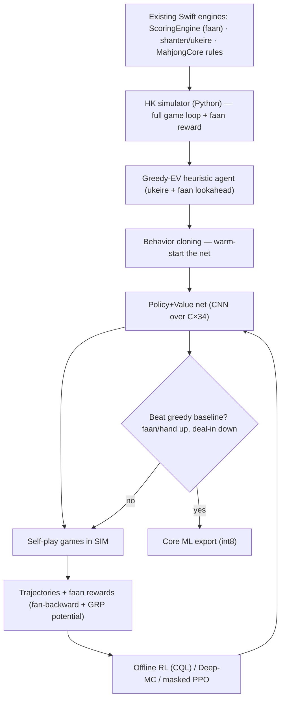
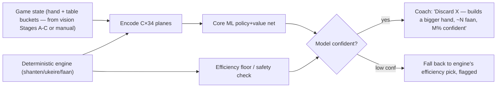

# HK Faan-Maximizing Coach — Learned Decision Model (implementation plan)

> **Related track:** the deterministic table-aware Coach (live-tile counting) shipped as "Stage D"
> and its automatic camera-zoning (Stages A–C) remain pending — that plan lives in git history of this
> file. This document is the **separate, larger workstream** the user asked for: a *learned* model for
> early/mid-game, value-maximizing decisions. No code this round — research + plan only.

## Context — why a learned model, not more engine
The shipped shanten/ukeire Coach is correct for **late-game efficiency**, but it structurally cannot
play the **early/mid game**, where HK mahjong is actually decided:
- **The objective is faan, not speed.** HK has a **3-faan minimum** (a fast no-faan tenpai is
  *legally unwinnable* and scores 0) and roughly **exponential faan→payout**. A shanten engine that
  rushes tenpai routinely reaches a worthless hand and can never trade speed for value.
- **Huge branching + hidden information.** Opening turns have dozens of near-equal choices whose value
  only resolves probabilistically over the hand. This is not solvable by a deterministic rule; it's a
  learned expected-value judgment — exactly what strong human players develop.

**Goal:** an **on-device** neural policy that recommends the faan-maximizing move (discard/call) with an
**expected-faan** figure and a **confidence**, integrated into Coach beside the deterministic engine.

## Research verdicts (grounding — full agent reports on disk)
- **No public HK decision dataset exists** (only scoring libraries). Supervised-on-HK is impossible →
  **self-play RL using our own HK `ScoringEngine` as the reward is the path** (no external data, no
  ToS/licensing exposure).
- **Architecture = CNN over a `C×34` tensor** (the Suphx/Mortal family) — proven, small, Core-ML-
  friendly. Transformers (Tjong, 15M params; kanachan) work but show **no clear strength edge** and add
  mobile friction. The famous **"ViT mahjong" repos are tile-image classifiers, not decision models** —
  not relevant to policy (this resolves the user's "ViT for decision" memory: it was perception).
- **On-device is trivial.** A Mortal-class net (~11–16M params) → **~11–15 MB int8, single-digit ms on
  A16**; a **turn-based** coach removes all latency pressure and even allows a search around the policy.
  **No shipping app runs a learned HK policy on-device → genuine product edge.**
- **Compute is small-team-scale**: 1–4 GPUs over days–weeks. Precedents: **Tjong** (fan-scored, top-1%
  Botzone) = 2 GPUs / 7 days; **DouZero** (imperfect-info card game from scratch) = 4×1080Ti / 2–10 days.
  Suphx's 44-GPU scale is the ceiling, **not** the entry point.
- **Licensing:** Mortal / libriichi / Akagi are **AGPL-3.0** → clean-room reimplement the *architecture*;
  never embed their code or weights in the closed app. Optional riichi trunk-pretrain uses **CC BY 4.0**
  data (`tenhou-to-mjai`, 2.5M games) and is *not* load-bearing.

## The model

### Type
An **actor-critic policy+value network**, a **1D-ResNet over a `C×34` tensor** (Suphx/Mortal family).
The existing deterministic engine becomes the model's **look-ahead feature extractor** (Suphx design).
A transformer backbone is a deferred experiment, not v1.

### State encoding — `C × 34` planes (C ≈ 150–300; start ~150)
34 = the distinct base tiles. Each feature is a length-34 plane; planes stack as channels:

| Group | Planes (per the Suphx/Mortal encodings) |
|---|---|
| My hand | 4 planes (≥1..≥4 copies) + a "just-drawn" plane |
| Each player's discard river (×4) | presence + recency/order planes (feeds danger reading) |
| Melds/calls (×4 players) | which tiles chi/pon/kon, and from whom |
| Round/seat winds, dealer, wall-remaining, turn #, all four scores | broadcast or bucketed binary planes |
| **Look-ahead planes** | **our shanten/ukeire/faan-potential engine output** (Suphx's 100+ search planes) |
| Oracle planes (**train-time only**) | opponents' concealed tiles + wall, annealed out (oracle guiding) |

HK drops riichi/aka-dora channels entirely — the tensor is *smaller* than riichi.

### Action space (HK — ~40 discrete, smaller than riichi's 46)
34 discards + chi + pon + kong + win + pass. **No riichi, no aka-dora kan.** **Legal-action masking is
mandatory.** Unified single-head (Mortal style) is simplest; multi-head (Suphx/Tjong: discard head +
binary call heads) is the alternative.

### Network
- Input `C×34` → **1D-ResNet, no pooling** ("every column has semantic meaning").
- **v1: 128ch × ~20 blocks** (~a few M params). **v2: 192ch × 40 blocks** (Mortal-class ~11–16M).
- Heads: **policy** (softmax over legal actions) + **value** (scalar = expected faan outcome). Optional
  **GRP GRU** (hidden 64, 2 layers) for reward densification at train time.

## Reward design — faan maximization (the core requirement)
A naive win-rate reward yields a "rush any cheap win" bot that, under the 3-faan gate, **scores zero**.
The reward must encode value:
- **Terminal, per hand:** win → **capped faan if faan ≥ 3, else 0** (encodes the minimum directly and
  the limit cap); **deal-in (放銃) → −(faan paid)**, weighted by the HK payment matrix (discarder pays
  full; self-draw all pay). Draw ≈ 0.
- **Densification (sparse→dense credit):**
  - **Tjong "fan-backward"** — back-propagate the completed hand's faan to the earlier moves that built
    that shape (the closest published *faan-maximization* mechanism).
  - and/or **Suphx global-reward-prediction** — a GRU potential `Φ(state)→expected final faan`; per-move
    reward = `Φ(xₖ) − Φ(xₖ₋₁)`.
- **Coaching risk knob:** objective = **`EV(faan) − λ·Var(faan)`** (or a deal-in-rate penalty). High λ →
  "protect your lead / avoid 放銃"; low λ → "push for the big hand." Exposed as a Coach setting.

## Data & training

### Self-play (primary path — needs no external data)

1. **HK simulator (Python, fast):** the foundational reusable asset — full HK loop (deal, draw, discard,
   chi/pon/kong, win detection, wall, scoring) mirroring `MahjongCore` rules, with the **`ScoringEngine`
   faan logic as the reward** and `EfficiencyEngine` for feature planes. **Validate it cell-for-cell
   against the Swift `ScoringEngine`.** Seed/cross-check against `clarkwkw/mahjong-ai` (the only public
   HK engine; TF1.8, has a HK `ScoringRules` faan module).
2. **Warm-start:** build a **greedy-EV heuristic** (ukeire + faan lookahead) and **behavior-clone** it
   into the net — collapses cold-start exploration (the biggest sample-efficiency lever we have).
3. **RL:** recommended **offline RL (CQL, Mortal-style) on self-play logs** (single GPU, *no* self-play
   farm — the sweet spot), or **DouZero-style Deep Monte-Carlo** (from scratch, single multi-GPU box);
   masked **PPO** is the online alternative (Tjong/Mahjax). Iterate self-play → retrain → stronger.

### Optional riichi trunk-pretrain (not load-bearing)
Pretrain the conv trunk on the **CC BY 4.0** mjai corpus (`tenhou-to-mjai`, 2.5M games) for generic
efficiency/danger features; swap heads; HK-fine-tune. Marginal; only if cheap. **Do not plan around it.**

### Compute budget
- **v1 (beats greedy baseline):** 1–2 GPUs, days.  **v2 (near-expert):** 4 GPUs, 1–2 weeks.
- PyTorch; sim in Python (v1) → Rust/JAX only if throughput-bound.

## On-device deployment & app integration

- **Export:** PyTorch → `coremltools` → `.mlpackage`; int8/fp16 (~11–15 MB). Stable filename so model
  upgrades are a drop-in (same pattern as the tile detector). Runs **once per decision** → latency
  irrelevant; can even run a few-hundred-sim search around the policy in Swift.
- **Hybrid Coach:** keep the deterministic engine (efficiency + safety + feature planes); the learned
  model supplies the early/mid-game faan-aware move + expected-faan + confidence; **confidence-gate**
  to the engine when the model is unsure (NAGA-style). Coach UI surfaces the move, the expected faan,
  and the value-vs-speed reasoning.

## Evaluation
- **Primary:** average **faan-per-hand** and win-value **beat the greedy-EV baseline** in head-to-head
  self-play, with **deal-in rate controlled**. That single comparison proves value-seeking works.
- **Ladders:** round-robin vs heuristic / MCTS / prior checkpoints.
- **Human eval:** agreement with strong HK players on curated early-game spots; A/B the coach.
- **Regression guard:** never underperform the deterministic engine on clear late-game spots.

## Phased roadmap
- **P0 (done):** deterministic engine + live-tile counting (shipped).
- **P1:** HK simulator + greedy-EV baseline + self-play harness (Python). *Milestone: simulator faan
  matches Swift `ScoringEngine` exactly.* (P1's greedy-EV agent already ships a value-aware upgrade even
  before any neural training.)
- **P2:** behavior-clone + small CNN v1; **beat the greedy baseline** in self-play.
- **P3:** scale (192×40), reward densification (fan-backward + GRP), risk knob; near-expert.
- **P4:** Core ML export + on-device hybrid Coach + UI.
- **P5 (optional):** transformer experiment, riichi trunk pretrain, online search.

## Licensing & IP
Clean-room the architecture (AGPL on Mortal/libriichi/Akagi bars embedding their code/weights). Self-play
generates our own data → no dataset licensing. Optional riichi pretrain data is CC BY 4.0 (attribution).

## Risks & open questions
- **Simulator fidelity** — must match `ScoringEngine` faan exactly (house-rule variants parameterized).
- **Compute access** — needs a 1–4 GPU box or modest cloud; if unavailable, P1's greedy-EV baseline still
  ships value-awareness with zero training.
- **Reward tuning** — value-vs-variance calibration; confidence calibration for the coach.
- **Scope** — is this a feasibility spike (P1–P2) or a committed on-device ship (through P4)?

## Key sources
Suphx arxiv 2003.13590 · Mortal github.com/Equim-chan/Mortal (AGPL) · Tjong DOI 10.1049/cit2.12298
(fan-backward reward) · DouZero arxiv 2106.06135 · kanachan github.com/Cryolite/kanachan · HK engine
github.com/clarkwkw/mahjong-ai · riichi data github.com/NikkeTryHard/tenhou-to-mjai (CC BY 4.0) ·
coremltools apple.github.io/coremltools.
